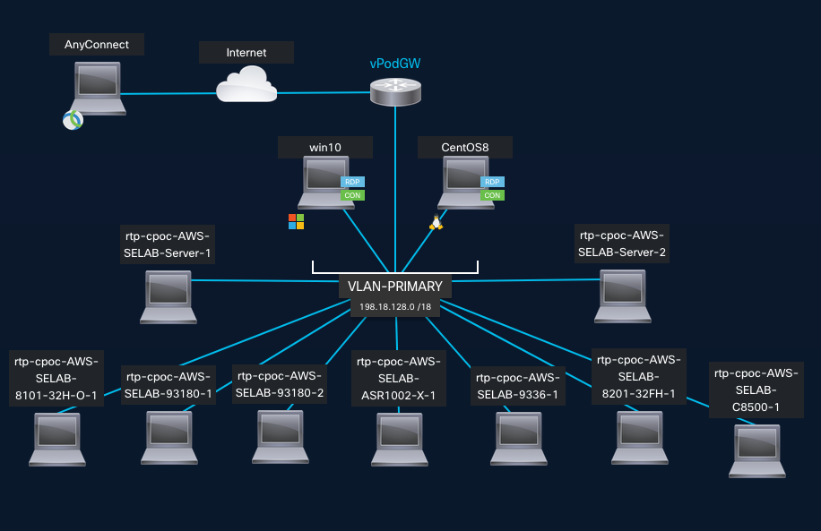
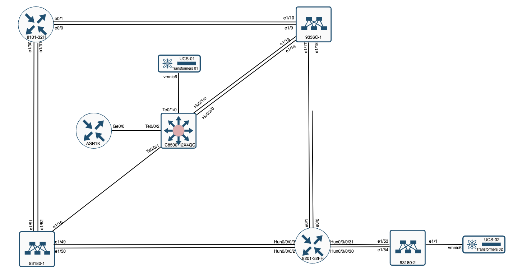
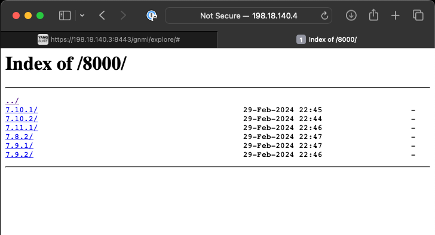
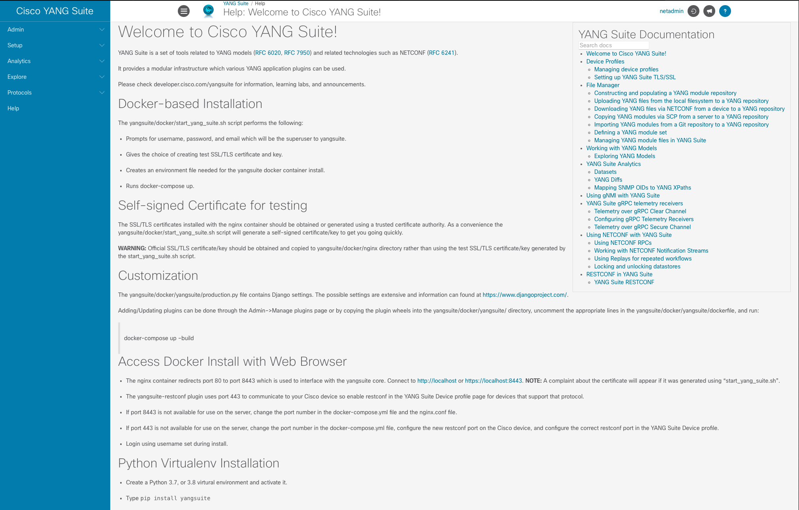
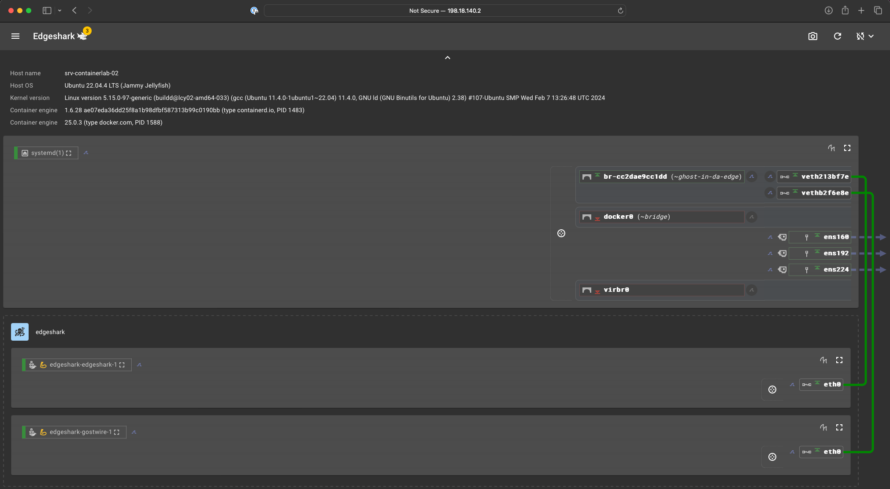
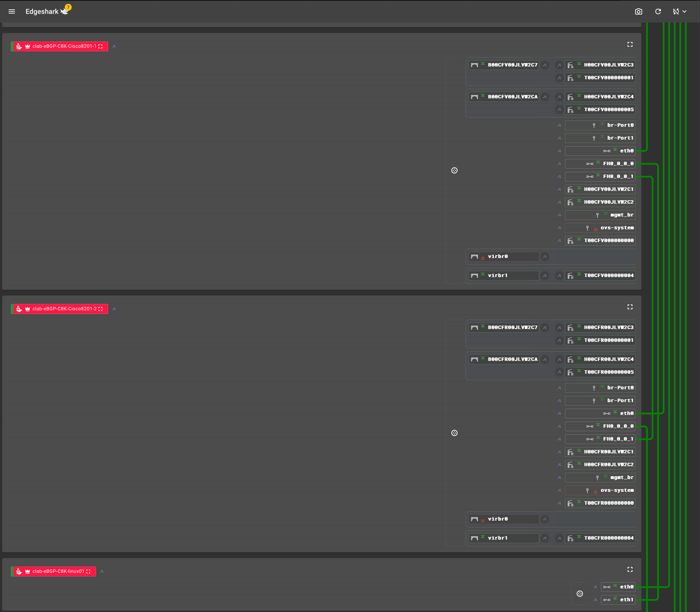

<span style="margin-right: 100px;"></span> <!-- Adjust the 20px to whatever space you need -->
 


<br>

# AWS SE Lab - dCloud RTP

This document provides an overview of the AWS network lab setup, including details about device configurations, IP addressing, physical wiring, software versions, and access credentials.

## Overview

This lab has been designed to replicate an AWS DX environment.

## dCloud Instance information

The dCloud instance can be acessed [here](https://tbv3-ui.ciscodcloud.com/sessions/1100269?versionUid=5keb2q7ysicl3ecjkhxszlbtg) and is connected using a management vlan of 198.18.128.0/18




In order to connect  to the lab, you must be on the dCloud RTP SSL VPN:

AnyConnect credentials:
VPN: https://dcloud-rtp-anyconnect.cisco.com
User: v1447user1
Password: 585282


The VPN instance can support up to 16 different users connected to the lab simultaneously.

User1 : v232user1

....

User16: v232user16


## Contact Information

Provide contact information for individuals responsible for the lab, such as network administrators or IT support staff.


- [Nicolas Michel, Solution Architect](nicmcl@cisco.com)
- [Dakari heidelberg, Cisco RTP Lab Admin](dheidelb@cisco.com)
- [Geiner Ernesto Miranda, Cisco RTP Lab Admin](geimiran@cisco.com)

## Revision History - Changelog

Document any changes made to the lab setup, including updates to configurations, hardware changes, or topology modifications.

| Date       | Description                         | Author         |
|------------|-------------------------------------|----------------|
| 2023-12-11 | Initial document revision           | Nicolas MICHEL |
| 2023-12-12 | Added Diagrams and action items     | Nicolas MICHEL |
| 2023-12-30 | Added IP Addressing                 | Nicolas MICHEL |
| 2024-03-2  | Added MANY things :)                | Nicolas MICHEL |
| 2023-03-15 | DX Topology                         | Nicolas MICHEL |
| 2023-03-18 | Changed Credentials                 | Nicolas MICHEL |

*Last Updated: [2024-03-18]*

## Backlog

- Document how the Physical 8K communicate with the containerlab
- Port Forwarding for containerlab

- Upgrade Cisco Nexus 9000
- Upgrade Cisco 8201-32FH using manual CLI 
- Upgrade Cisco 8201-32FH using Yang Model
- Install Virtual Machines for telemetry.
- Netconf Script to create and delete VRF
  - Add telemetry to calculate VRF CRUD


## Physical Topology (WIP)

Describe the physical layout of the network, including how devices are interconnected. Consider using a diagramming tool to create a network topology diagram and include it here.

[DrawIO Diagram](./LAB-AWS-DX-RTP-Diagram-Physical.drawio)
 


## Remote Desktop

2 Virtual machines are available in this dCloud instance for various purpose.
The information are the following:

| Device Type         | IP Address     | Access Method        | Username         | Password      |
|---------------------|----------------|----------------------|------------------|---------------|
| Windows 10          | 198.18.133.10  | RDP over port 3389   | DCLOUD\demouser  | C1sco12345    |
| CENTOS              | 198.18.133.42  | RDP over port 3389   | dcloud           | C1sco12345    |


## Network Devices Inventory

The lab in RTP uses the following subnet information: 198.18.128.0/18

```
Address:   198.18.128.1         11000110.00010010.10 000000.00000001
Netmask:   255.255.192.0 = 18   11111111.11111111.11 000000.00000000
Wildcard:  0.0.63.255           00000000.00000000.00 111111.11111111
=>
Network:   198.18.128.0/18      11000110.00010010.10 000000.00000000
HostMin:   198.18.128.1         11000110.00010010.10 000000.00000001
HostMax:   198.18.191.254       11000110.00010010.10 111111.11111110
Broadcast: 198.18.191.255       11000110.00010010.10 111111.111111

```

The default gateway for this lab is 198.18.128.1
The DNS queries for this lab shoudl be directed to the following DNS server: 198.18.128.1


List all network devices used in the lab, including routers, switches, firewalls, etc.

Table sorted per Device Type:

| Device Type         | Device Name                    | Model                  | Software Version                                     | Management IP |
|---------------------|--------------------------------|------------------------|------------------------------------------------------|---------------|
| AWS VC-CAS          | rtp-cpoc-AWS-SELAB-9336-1      | Cisco N9K-C9336C-FX2   | NX-OS 10.2(6)                                        | 198.18.128.2  |
| AWS VC-CAS          | rtp-cpoc-AWS-SELAB-93180-1     | Cisco N9K-C93180YC-FX  | NX-OS 10.2(6)                                        | 198.18.128.3  |
| AWS VC-CAS DX-GW    | rtp-cpoc-AWS-SELAB-93180-2     | Cisco N9K-C93180YC-FX  | NX-OS 10.2(6)                                        | 198.18.128.4  |
| AWS VC CAR          | rtp-cpoc-AWS-SELAB-8201-32FH-1 | Cisco 8201-32FH        | IOS XR 7.9.1                                         | 198.18.128.7  |
| Customer PE         | C8500-12X4QC-2                 | Cisco C8500-12X4QC     | IOS XE 17.09.03a                                     | 198.18.128.5  |
| Customer PE         | rtp-cpoc-AWS-SELAB-ASR1002-X-1 | Cisco ASR1002-X        | IOS XE 16.09.03a                                     | 198.18.128.15 |
| Google Core Router  | 8101-32H-O-1                   | Cisco 8101-32H-O       | SONiC.azure_cisco_202205.4677-dirty-20230524.051258  | 198.18.128.6  |


Table sorted per IP Address:

| Management IP | Device Type         | Device Name                    | Model                  | Software Version                                     |
|---------------|---------------------|--------------------------------|------------------------|------------------------------------------------------|
| 198.18.128.2  | AWS VC-CAS          | rtp-cpoc-AWS-SELAB-9336-1      | Cisco N9K-C9336C-FX2   | NX-OS 10.2(6)                                        |
| 198.18.128.3  | AWS VC-CAS          | rtp-cpoc-AWS-SELAB-93180-1     | Cisco N9K-C93180YC-FX  | NX-OS 10.2(6)                                        |
| 198.18.128.4  | AWS VC-CAS DX-GW    | rtp-cpoc-AWS-SELAB-93180-2     | Cisco N9K-C93180YC-FX  | NX-OS 10.2(6)                                        |
| 198.18.128.5  | Customer PE         | C8500-12X4QC-2                 | Cisco C8500-12X4QC     | IOS XE 17.09.03a                                     |
| 198.18.128.6  | Google Core Router  | 8101-32H-O-1                   | Cisco 8101-32H-O       | SONiC.azure_cisco_202205.4677-dirty-20230524.051258  |
| 198.18.128.7  | AWS VC CAR          | rtp-cpoc-AWS-SELAB-8201-32FH-1 | Cisco 8201-32FH        | IOS XR 7.8.2                                         |
| 198.18.128.15 | Customer PE         | rtp-cpoc-AWS-SELAB-ASR1002-X-1 | Cisco ASR1002-X        | IOS XE 16.09.03a                                     |

## Configurations 

Configurations are saved using a python script. It is still a work in progress as not all the devices are configured yet.

Configurations are saved on srv-ubuntu-01 (198.18.140.3) in the /home/netadmin/code/backup folder.


```
from netmiko import ConnectHandler
from datetime import datetime
import os

# Device details with an added 'name' field for custom filenames
devices = [
    {'device_type': 'cisco_xe', 'host': '198.18.128.5', 'username': 'admin', 'password': 'C1sco12345', 'name': 'AWS-DX-Customer_PE'},
    {'device_type': 'cisco_nxos_ssh', 'host': '198.18.128.3', 'username': 'admin', 'password': 'C1sco12345', 'name': 'AWS-DX-VC-CAS'},
    {'device_type': 'cisco_xr', 'host': '198.18.128.7', 'username': 'admin', 'password': 'C1sco12345', 'name': 'AWS-DX-VC-CAR'}
]

# Backup directory
backup_dir = "/home/netadmin/code/backup/files"

# Ensure backup directory exists
if not os.path.exists(backup_dir):
    os.makedirs(backup_dir)

# Function to backup device configuration
def backup_config(device):
    try:
        # Copy the device dictionary to avoid modifying the original
        device_info = device.copy()
        # Extract and remove the 'name' key from the device_info dictionary
        device_name = device_info.pop('name')
        # Establish SSH connection without the 'name' key
        net_connect = ConnectHandler(**device_info)
        # Get the current date and time for the filename
        now = datetime.now().strftime("%Y-%m-%d_%H-%M-%S")
        # Use device name for the filename
        filename = f"{backup_dir}/{device_name}_{now}.cfg"
        # Fetching configuration
        config = net_connect.send_command("show running-config")
        # Writing configuration to file
        with open(filename, 'w') as config_file:
            config_file.write(config)
        print(f"Backup completed for {device_name} on {now}")
    except Exception as e:
        print(f"Failed to backup {device_name}: {str(e)} on {now}" )

# Backup configurations for all devices
for device in devices:
    backup_config(device)
```


Then a cron job will be run to backup the configurations for all devices.

```
netadmin@srv-ubuntu-01:/home/netadmin/code/backup $ crontab -l

0 8 * * 1 /usr/bin/python3 /home/netadmin/code/backup/backup.py >> /home/netadmin/code/backup/logfile.log 2>&1
```

When the script is run, it should generate a log file for every device.

```
netadmin@srv-ubuntu-01:/home/netadmin/code/backup $ python3 backup.py
Backup completed for AWS-DX-Customer_PE on 2024-03-01_23-57-26
Backup completed for AWS-DX-VC-CAS on 2024-03-01_23-57-27
Backup completed for AWS-DX-VC-CAR on 2024-03-01_23-57-28
```


## Access Credentials

List the credentials required to access the devices. 

| Device Type         | Device Name                    | Access Method          | Username                                             | Password      |
|---------------------|--------------------------------|------------------------|------------------------------------------------------|---------------|
| AWS VC-CAS          | rtp-cpoc-AWS-SELAB-9336-1      | SSH                    | admin                                                | C1sco12345    |
| AWS VC-CAS          | rtp-cpoc-AWS-SELAB-93180-1     | SSH                    | admin                                                | C1sco12345    |
| AWS VC-CAS DX-GW    | rtp-cpoc-AWS-SELAB-93180-2     | SSH                    | admin                                                | C1sco12345    |
| AWS VC CAR          | rtp-cpoc-AWS-SELAB-8201-32FH-1 | SSH                    | admin                                                | C1sco12345    |
| Customer PE         | C8500-12X4QC-2                 | SSH                    | admin                                                | C1sco12345    |
| Customer PE         | rtp-cpoc-AWS-SELAB-ASR1002-X-1 | SSH                    | admin                                                | C1sco12345    |
| Google Core Router  | 8101-32H-O-1                   | SSH                    | cisco                                                | cisco123      |


## Server Devices Inventory


List all Physical servers devices used in the lab

Table sorted per Device Type:

| Device Type            | Device Name                        | Model - Version                                                                                                       | Software Version                                    | Username | Password    |
|------------------------|------------------------------------|----------------------------------------------------------------------------------------------------------------------|------------------------------------------------------|----------|-------------|
| Physical Server - CIMC | transformers-cimc-1                | UCS C220 M4S - 2x CPU Intel(R) Xeon(R) CPU E5-2630 v4 @ 2.20GHz - 10 Cores - 40 Threads - 256 GB RAM - 2TB Storage   | [198.18.157.16](https://198.18.157.16/)              | admin    | C1sco12345! |
| Hypervisor - ESXi      | transformers-1.dcloud.cisco.com    | VMware 7.0 Update 3                                                                                                  | [198.18.157.6](https://198.18.157.6/ui/#/host)       | root     | C1sco12345! |
| Physical Server - CIMC | transformers-cimc-2                | UCS C220 M4S - 2x CPU Intel(R) Xeon(R) CPU E5-2630 v4 @ 2.20GHz - 10 Cores - 40 Threads - 256 GB RAM - 2TB Storage   | [198.18.157.17](https://198.18.157.17/)              | admin    | C1sco12345! |
| Hypervisor - ESXi      | transformers-2.dcloud.cisco.com    | VMware 7.0 Update 3                                                                                                  | [198.18.157.7](https://198.18.157.7/ui/#/host)       | root     | C1sco12345! |


## Software, Virtual Machines and Tools

List any software or tools required to interact with the devices, such as terminal emulators, SSH clients, or network management software.

| VM name                | Hosts           | Comment                            | Operating System      | Specs                                    | IP Address    | Username | Password    |
|------------------------|-----------------|------------------------------------|-----------------------|------------------------------------------|---------------|----------|-------------|
| SRV-CONTAINERLAB-01    | Transformers 01 | Containerlab 01                    | Ubuntu 22.04.03 LTS   | 40vCPU - 192 G Memory - 400 GB Storage   | 198.18.140.1  | netadmin | C1sco12345! |
| SRV-CONTAINERLAB-02    | Transformers 02 | Containerlab 02                    | Ubuntu 22.04.03 LTS   | 40vCPU - 220 G Memory - 400 GB Storage   | 198.18.140.2  | netadmin | C1sco12345! |
| SRV-Ubuntu-01          | Transformers 01 | Network tools and Telemetry        | Ubuntu 22.04.03 LTS   | 8vCPU  - 16 G Memory  - 500 GB Storage   | 198.18.140.3  | netadmin | C1sco12345! |
| SRV-Rocky-01           | Transformers 02 | Network tools                      | Rocky Linux 9.3       | 8vCPU  - 16 G Memory  - 250 GB Storage   | 198.18.140.3  | netadmin | C1sco12345! |
| SRV-Rocky-01           | Transformers 02 | Network tools                      | Rocky Linux 9.3       | 8vCPU  - 16 G Memory  - 250 GB Storage   | 198.18.140.4  | netadmin | C1sco12345! |
| SRV-FREEBSD-01         | Transformers 01 | FreeBSD Lab                        | FreeBSD 14.0          | 8vCPU  - 16 G Memory  - 200 GB Storage   | 198.18.140.6  | netadmin | C1sco12345! |
| SRV-AWS-DX-Customer-01 | Transformers 01 | AWS DX Customer 01                 | Ubuntu 22.04.03 LTS   | 2vCPU  - 4  G Memory  - 40  GB Storage   | 198.18.140.5  | netadmin | C1sco12345! |

# Web Server

This lab has a nginx container running on Rocky linux (Transformers 01) to serve the lab and distribute images using HTTP.

It is important to note that this nginx container has a custom configuration file so that it can be browsed using automatic directory listing (to ease the usability of the lab).

NGINX Configuration.

```
[netadmin@srv-rocky-01 ~]$ cat nginx/default.conf
server {
    listen       80;
    server_name  localhost;

    location / {
        root   /usr/share/nginx/html;
        index  index.html index.htm;
        autoindex on;  # Enable automatic directory listings
    }

    # Redirect server error pages to the static page /50x.html
    error_page   500 502 503 504  /50x.html;
    location = /50x.html {
        root   /usr/share/nginx/html;
    }
}

```


HTTP folder architecture.
```
[netadmin@srv-rocky-01 networking]$ pwd
/home/netadmin/networking


[netadmin@srv-rocky-01 networking]$ tree
.
├── 8000
│   ├── 7.10.1
│   │   ├── 8000-k9sec-rpms.7.10.1.tar
│   │   ├── 8000-optional-rpms.7.10.1.tar
│   │   ├── 8000-x64-7.10.1.docs.tar
│   │   ├── 8000-x64-7.10.1.iso
│   │   └── 8000-x64-usb-7.10.1.zip
│   ├── 7.10.2
│   │   ├── 8000-optional-rpms.7.10.2.tar
│   │   └── 8000-x64-usb-7.10.2.zip
│   ├── 7.11.1
│   │   ├── 8000-k9sec-rpms.7.11.1.tar
│   │   ├── 8000-optional-rpms.7.11.1.tar
│   │   ├── 8000-x64-7.11.1.docs.tar
│   │   ├── 8000-x64-7.11.1.iso
│   │   └── 8000-x64-usb-7.11.1.zip
│   ├── 7.8.2
│   │   ├── 8000-k9sec-rpms.7.8.2.tar
│   │   ├── 8000-optional-rpms.7.8.2.tar
│   │   ├── 8000-x64-7.8.2.docs.tar
│   │   ├── 8000-x64-7.8.2.iso
│   │   └── 8000-x64-usb-7.8.2.zip
│   ├── 7.9.1
│   │   ├── 8000-k9sec-rpms.7.9.1.tar
│   │   ├── 8000-x64-7.9.1.docs.tar
│   │   ├── 8000-x64-7.9.1.iso
│   │   ├── 8000-x64-optional-rpms.7.9.1.tar
│   │   └── 8000-x64-usb-7.9.1.zip
│   ├── 7.9.2
│   │   ├── 8000-k9sec-rpms.7.9.2.tar
│   │   ├── 8000-x64-7.9.2.docs.tar
│   │   ├── 8000-x64-7.9.2.iso
│   │   ├── 8000-x64-optional-rpms.7.9.2.tar
│   │   └── 8000-x64-usb-7.9.2.zip
│   └── lol.lol
└── c8k-update-v2.tar

7 directories, 29 files
```

Here are the commands needed to launch the nginx container using the custom configuration file:

```
[netadmin@srv-rocky-01 nginx]$ docker run --name nginx-lab \
> -v /home/netadmin/nginx/default.conf:/etc/nginx/conf.d/default.conf:ro \
> -v /home/netadmin/networking:/usr/share/nginx/html:ro \
> -p 8080:80 \
> -d \
> nginx:latest
a49f39273502ad63dcb98401a9964fef66f7c8ec0adbfe8aa7864e1887fbe623
```

It is now possible to browse the folder using : http://198.18.140.4:8080

```
(base) nmichel@NICMCL-M-NX99:/Users/nmichel/Downloads $ wget http://198.18.140.4:8080                                                                       
--2024-02-29 17:15:45--  http://198.18.140.4:8080/
Connecting to 198.18.140.4:8080... connected.
HTTP request sent, awaiting response... 200 OK
Length: unspecified [text/html]
Saving to: ‘index.html’

index.html                                                 [ <=>                                                                                                                        ]     367  --.-KB/s    in 0s      

2024-02-29 17:15:45 (50.0 MB/s) - ‘index.html’ saved [367]
```





image should be available at http://198.18.140.4:8080/8000/7.10.1/8000-x64-7.10.1.iso for example


Verification:

```
[netadmin@srv-rocky-01 nginx]$ docker logs -f nginx-lab
...
198.18.140.3 - - [29/Feb/2024:23:23:55 +0000] "GET /8000/7.10.1/8000-x64-7.10.1.iso HTTP/1.1" 200 1685852160 "-" "Wget/1.21.2" "-"
```


# Yang Suite

This lab has an yang suite set of containers that allow you to get the latest information regarding the yang model on any devices of the Cisco portfolio. The yang suite is running on SRV-Ubuntu-01 (Transformers 01).

Git repo has been cloned:

```
netadmin@srv-ubuntu-01:/home/netadmin $ git clone https://github.com/CiscoDevNet/yangsuite.git
Cloning into 'yangsuite'...
remote: Enumerating objects: 917, done.
remote: Counting objects: 100% (122/122), done.
remote: Compressing objects: 100% (83/83), done.
remote: Total 917 (delta 45), reused 112 (delta 39), pack-reused 795
Receiving objects: 100% (917/917), 74.23 MiB | 44.32 MiB/s, done.
Resolving deltas: 100% (371/371), done.
```


Containers need to be created and started:

```

netadmin@srv-ubuntu-01:/home/netadmin/yangsuite/docker git:(main) $ ./start_yang_suite.sh
Hello, please setup YANG Suite admin user.
username: netadmin
password:
confirm password:
Will you access the system from a remote host? (y/n): y
Enter local host FQDN or IP: 198.18.140.3
email: nicmcl@cisco.com

Setup test certificates? (y/n): y
################################################################
## Generating self-signed certificates...                     ##
##                                                            ##
## WARNING: Obtain certificates from a trusted authority!     ##
##                                                            ##
## NOTE: Some browsers may still reject these certificates!!  ##
################################################################

...+..................+...+......+.+++++++++++++++++++++++++++++++++++++++++++++++++++++++++++++++++*.....+......+...+...+....+...+..+....+..+...+.+.........+..+.........+++++++++++++++++++++++++++++++++++++++++++++++++++++++++++++++++*.......+..+...+............+.+.....................+.........+.....+......+...+.+......+......+.....+....+......+.....+.......+..+....+..+....+.....+...+.+......+........+.+..+...+.......+...............+.....+............+.......+...+..+......+.......+.....................+.....+.+........+...+............+.+............+.....+....+...+..+...+..........+..+.+...+..+...+....+.....+...+.......+........+...+...................+..+.+...+...............+.........+..+...+.......+.....+.........+.........................+.....+.+..................+..+.+..+.......+.....+...+.......+......+.....+....+.....+......+.......+...+.....+.........+...+.+..+...+.........+......+.....................+......+....+......+..+.......+...........+.........+....+..+....+...............+...+......+......+......+..+.+.....+...............+.........+......+......+.+...............+...+...........+......+....+...+......+.........+.................+.+..+...+...+.........+...+...+.+.........+..+.......+......+.........+..+.........+.+........+.+..+.............+..............+......+......+......+....+..............+..........+.........+..+...+......+.+......+..+...+.......+...+.........+......+..+.+.....+............+.........+......+..........+...+.........+......+.....+.+..................+..+.........+.+........+......+....+...+..+......+....+........+..........+..+.......+...+.....+...+....+...........+....+...+.....+......+..........+.....+....+................................+......+....+...+..+....+..+............+......+.+++++++++++++++++++++++++++++++++++++++++++++++++++++++++++++++++
.+.......+......+.....+++++++++++++++++++++++++++++++++++++++++++++++++++++++++++++++++*.+...+++++++++++++++++++++++++++++++++++++++++++++++++++++++++++++++++*..+..+......+............+.......+...+...+..+....+..............+....+......+.........+..+..........+......+.........+...+..+.+.....+.......+..+.............+..+.+...+..............+.+............+..+.+.....+.+.....+.+...............+........+.+.....+...+.............+...+...........+...+................+.........+.....+.+......+..............+.+.....+.............+..+................+...+++++++++++++++++++++++++++++++++++++++++++++++++++++++++++++++++
-----
You are about to be asked to enter information that will be incorporated
into your certificate request.
What you are about to enter is what is called a Distinguished Name or a DN.
There are quite a few fields but you can leave some blank
For some fields there will be a default value,
If you enter '.', the field will be left blank.
-----
Country Name (2 letter code) [AU]:US
State or Province Name (full name) [Some-State]:NC
Locality Name (eg, city) []:RTP
Organization Name (eg, company) [Internet Widgits Pty Ltd]:Cisco
Organizational Unit Name (eg, section) []:AWS-DX-SE-Lab
Common Name (e.g. server FQDN or YOUR name) []:localhost
Email Address []:nicmcl@cisco.com
Certificates generated...

```


yang Suite can be reached at : https://198.18.140.3:8443


To make it easier and persistent, it is recommended to run these container using docker compose and by detaching the container from the CLI:

```
netadmin@srv-ubuntu-01:/home/netadmin/yangsuite/docker git:(main*) $ docker compose up -d
[+] Running 3/3
 ✔ Container docker-yangsuite-1  Started   0.0s
 ✔ Container docker-backup-1     Started   0.0s
 ✔ Container docker-nginx-1      Started   0.0s
 ```





# Edge Shark

Edge shark is a suite of containers that allows you to sniff container traffic in a very easy way. Source code can be found here: https://github.com/siemens/edgeshark
From the documentation: If you want to live capture traffic using Wireshark, please download the csharg extcap plugin for the OS/distribution and install it (https://github.com/siemens/cshargextcap/releases). Read the documentation here: => https://github.com/siemens/cshargextcap


Edgeshark is composed of the following components:
- ghcr.io/siemens/packetflix => https://github.com/siemens/packetflix/pkgs/container/packetflix
- ghcr.io/siemens/ghostwire => https://github.com/siemens/ghostwire/pkgs/container/ghostwire


Each server where containerlab has been installed contains an edgeshark suite. Also, the Ubuntu-01 server has edgeshark containers but not restarted automatically.

```
 wget -q --no-cache -O - \\n  https://github.com/siemens/edgeshark/raw/main/deployments/wget/docker-compose.yaml \\n  | docker compose -f - up -d
```

A script has been created to start the edgeshark containers:

```
netadmin@srv-containerlab-02:/home/netadmin/edgeshark $ cat edgesharkd.sh
#!/bin/bash

wget -q --no-cache -O - \
  https://github.com/siemens/edgeshark/raw/main/deployments/wget/docker-compose.yaml \
  | docker compose -f - up -d


netadmin@srv-containerlab-02:/home/netadmin/edgeshark $ ./edgesharkd.sh
[+] Running 6/6
 ✔ edgeshark 2 layers [⣿⣿]      0B/0B      Pulled                                                                                                                                                         8.1s
   ✔ ce715ac60835 Pull complete                                                                                                                                                                           4.0s
   ✔ e27fab22e5de Pull complete                                                                                                                                                                           4.1s
 ✔ gostwire 2 layers [⣿⣿]      0B/0B      Pulled                                                                                                                                                          7.1s
   ✔ 4abcf2066143 Already exists                                                                                                                                                                          0.0s
   ✔ ee2c3397c828 Pull complete                                                                                                                                                                           4.0s
[+] Running 2/2
 ✔ Container edgeshark-edgeshark-1  Started                                                                                                                                                               1.0s
 ✔ Container edgeshark-gostwire-1   Started


````

Example of the Edgeshark GUI:



While deploying a lab we can see all the other containers. Here a lab with 2x 8201-32FH:




