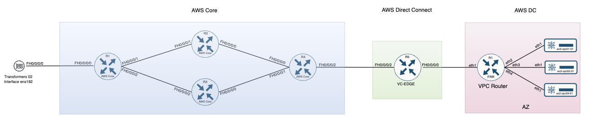
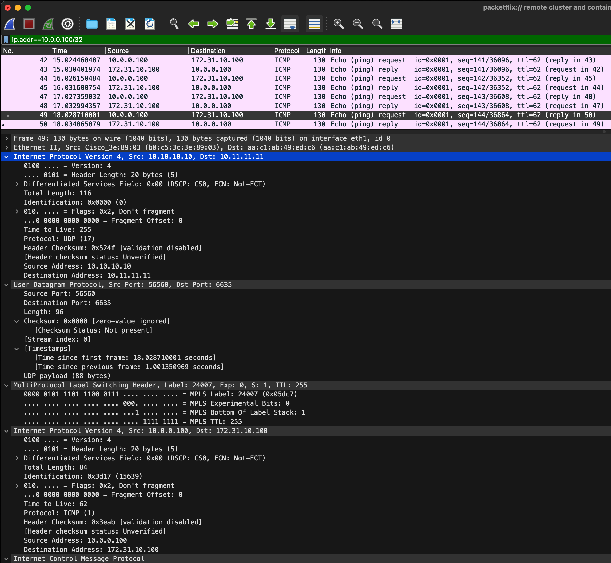

<span style="margin-right: 100px;"></span> <!-- Adjust the 20px to whatever space you need -->
 


<br>

# AWS Direct Connect


## Contact Information
  
- [Nicolas Michel, Solution Architect](nicmcl@cisco.com)

Revision information:

v1.0 : Bidirectional communication working between the DC and the EC2 servers.


## Revision History - Changelog

Document any changes made to the lab setup, including updates to configurations, hardware changes, or topology modifications.

| Date       | Description                                    | Author         |
|------------|------------------------------------------------|----------------|
| 2024-03-19 | Initial document revision                      | Nicolas MICHEL |
| 2024-08-01 | Added Automatic deployment and iperf           | Nicolas MICHEL |
| 2024-08-14 | Revamp on documentation                        | Nicolas MICHEL |

*Last Updated: [2024-08-15]*

## Lab Backlog for DX

- Implement Telemetry for the VC-CAS
- Implement Telemetry for the VC-CAR
- Add Routing Scale tests : 1M Routes
- Implement Netconf script to monitor Move/Add/Changes/Deletes
- Implement Accedian

## General Backlog

- Document how the Physical 8K communicate with the containerlab
- Port Forwarding for containerlab
- Upgrade Cisco Nexus 9000
- Upgrade Cisco 8201-32FH using manual CLI 
- Upgrade Cisco 8201-32FH using Yang Model


##  Customer AWS DX Physical Topology

Here is a diagram that represents the AWS DX physical topology that we have in our lab
 


The following diagram represents the virtual topology that is hosted on a UCS server. This topology will allow us to simulate the AWS Core network as well as the VC-EDGE router connected to EC2 instance hosted in a VPC.



This virtual topology is hosted on a UCS server that is directly connected to the physical topology, allowing us to use virtual networking nodes interacting with the physical topology.

##  End to End Topology

As mentionned previously, the final topology is the result of combining the virtual topology with the physical topology. 


The goal is to allow us to simulate the AWS Core network as well as the VC-EDGE router connected instance. The compute nodes in the data center will be able to reach the virtualized EC2 instance over Direct Connect and the AWS Core.


## Container YAML Topology.

Here is the YAML topology used to simulate the AWS Core network and the AWS Data Center.

Initially the AWS Core routers were simulated using FRR but we encoutered a bug that prevented us to do so.will be simulated using FRR Containers to limit the footprint required.
The VC-EDGE will use a virtual Cisco 8201-32FH running version 7.10

```
name: AWS-DX
topology:
  nodes:

    ec2-vpc01-01:
      kind: linux
      image: vpackets/alpine-tools
      mgmt-ipv4: 172.20.20.11
      mgmt-ipv6: '2001:172:20:20::11'
      binds:
        - binds/ec2-01:/home
      exec:
        - ip addr add 172.31.10.100/24 dev eth1
        - ip route add 172.31.0.0/16 via 172.31.10.1
        - ip route add 10.0.0.0/24 via 172.31.10.1
        - chmod +x /home/iperf.sh


    ec2-vpc02-01:
      kind: linux
      image: vpackets/alpine-tools
      mgmt-ipv4: 172.20.20.12
      mgmt-ipv6: '2001:172:20:20::12'
      binds:
        - binds/ec2-02:/home
      exec:
        - ip addr add 172.31.20.100/24 dev eth1
        - ip route add 172.31.0.0/16 via 172.31.20.1
        - ip route add 10.0.0.0/24 via 172.31.20.1
        - chmod +x /home/iperf.sh


    ec2-vpc03-01:
      kind: linux
      image: vpackets/alpine-tools
      mgmt-ipv4: 172.20.20.13
      mgmt-ipv6: '2001:172:20:20::13'
      binds:
        - binds/ec2-03:/home
      exec:
        - ip addr add 172.31.30.100/24 dev eth1
        - ip route add 172.31.0.0/16 via 172.31.30.1
        - ip route add 10.0.0.0/24 via 172.31.30.1 
        - chmod +x /home/iperf.sh 


    ceos1:
      kind: ceos
      image: 'ceos:4.30.3M'
      mgmt-ipv4: 172.20.20.2
      mgmt-ipv6: '2001:172:20:20::2'

    ceos2:
      kind: ceos
      image: 'ceos:4.30.3M'
      mgmt-ipv4: 172.20.20.3
      mgmt-ipv6: '2001:172:20:20::3'

    ceos3:
      kind: ceos
      image: 'ceos:4.30.3M'
      mgmt-ipv4: 172.20.20.4
      mgmt-ipv6: '2001:172:20:20::4'

    ceos4:
      kind: ceos
      image: 'ceos:4.30.3M'
      mgmt-ipv4: 172.20.20.5
      mgmt-ipv6: '2001:172:20:20::5'

    Cisco8201-5:
      kind: cisco_c8000
      image: '8201-32fh_242:24.2.1.23l'
      mgmt-ipv4: 172.20.20.6
      mgmt-ipv6: '2001:172:20:20::6'

    vpc-router:
      kind: ceos
      image: 'ceos:4.30.3M'
      mgmt-ipv4: 172.20.20.20
      mgmt-ipv6: '2001:172:20:20::20'


  links:
    - type: macvlan
      endpoint:
        node: ceos1
        interface: eth1
      host-interface: ens192
      mode: passthru
    - type: veth
      endpoints:
        - node: ceos1
          interface: eth2
        - node: ceos2
          interface: eth2
    - type: veth
      endpoints:
        - node: ceos1
          interface: eth3
        - node: ceos3
          interface: eth3
    - type: veth
      endpoints:
        - node: ceos2
          interface: eth1
        - node: ceos4
          interface: eth1
    - type: veth
      endpoints:
        - node: ceos3
          interface: eth1
        - node: ceos4
          interface: eth2
    - type: veth
      endpoints:
        - node: ceos4
          interface: eth3
        - node: Cisco8201-5
          interface: FH0_0_0_2
    - type: veth
      endpoints:
        - node: Cisco8201-5
          interface: FH0_0_0_0
        - node: vpc-router
          interface: eth1
    - type: veth
      endpoints:
        - node: vpc-router
          interface: eth2
        - node: ec2-vpc01-01
          interface: eth1
    - type: veth
      endpoints:
        - node: vpc-router
          interface: eth3
        - node: ec2-vpc02-01
          interface: eth1
    - type: veth
      endpoints:
        - node: vpc-router
          interface: eth4
        - node: ec2-vpc03-01
          interface: eth1

```


### Baseline Commands:


| Device name               | Platform                         | Version              | Configuration                                                               |
|---------------------------|----------------------------------|----------------------|-----------------------------------------------------------------------------|
| Customer Router (CE)      | C8500-12X4QC                     | IOSXE: 17.09.03a     | [customer-ce.show_run.txt](./configurations/Customer-CE.txt)                |
| AWS DX - VC-CAS           | C93180YC-FX Chassis              | NXOS: 10.2(6)        | [aws-dx-vc-cas.show_run.txt](./configurations/AWS-DX-VC-CAS.txt)            |
| AWS DX - VC-CAR           | 8201-32FH                        | IOS-XR: 24.1.1       | [aws-dx-vc-car.show_run.txt](./configurations/AWS-DX-VC-CAR.txt)            |
| AWS Core Router 01        | N/A                              | N/A                  | [aws-core-01.show_run.txt](./configurations/AWS-CORE-CEOS01.txt)            |
| AWS Core Router 02        | N/A                              | N/A                  | [aws-core-02.show_run.txt](./configurations/AWS-CORE-CEOS02.txt)            |
| AWS Core Router 03        | N/A                              | N/A                  | [aws-core-03.show_run.txt](./configurations/AWS-CORE-CEOS03.txt)            |
| AWS Core Router 04        | N/A                              | N/A                  | [aws-core-04.show_run.txt](./configurations/AWS-CORE-CEOS04.txt)            |
| AWS DX - VC-EDGE          | 8201-32FH                        | IOS-XR: 7.10.1       | [aws-dx-vc-edge.show_run.txt](./configurations/AWS-DX-VC-EDGE.txt)          |
| AWS DC - Transport Switch | C93180YC-FX Chassis              | NXOS: 10.2(6)        | [aws-dc-transport.show_run.txt](./configurations/AWS-N9K-Transport.txt)     |
| AWS DC - VPC Router       | N/A                              | N/A                  | [aws-dc-vpc-router.show_run.txt](./configurations/AWS-VPC-Router.txt)       |

<br><br><br>

This lab is currently using an MPLSoUDP topology between the VC-CAR and the VC-EDGE routers. The Cisco 8201-32FH is the platform in charge of encapsulating and decapsulating the MPLSoUDP traffic between the customer on premises workloads and the EC2 instances in the AWS Data center.

The purpose of this lab is to validate the 8201-32FH platform for this particular use case, so all configuration exhibits will be focused on IOS-XR and this role.

## Lab Deployment

This Python script automates the configuration of network devices using NETCONF.

### Features:
- Waits for router initialization
- Applies configurations to Cisco and Arista devices
- Uses NETCONF for secure configuration management
- Logs actions and errors

### Requirements:
- Python 3.x
- ncclient library
- Docker (for container management)

### Usage:
1. Ensure network devices are accessible
2. Prepare XML configuration files
3. Run the script: `python script_name.py`

Note: Modify device credentials and configuration file names as needed.


```

import subprocess
import time
from ncclient import manager
import xml.dom.minidom

def log(message):
    timestamp = time.strftime('%Y-%m-%d %H:%M:%S')
    print(f"{timestamp} - {message}")

def wait_for_router_up(container_name, timeout=600):
    start_time = time.time()
    while time.time() - start_time < timeout:
        try:
            result = subprocess.run(
                ["docker", "logs", container_name],
                capture_output=True,
                text=True,
                check=True
            )
            log(f"Docker logs for {container_name}:\n{result.stdout}")
            if "Router up" in result.stdout:
                log(f"{container_name} is up. Waiting 30 seconds for full initialization...")
                time.sleep(30)  # Wait for 30 seconds after "Router up" is detected
                log(f"{container_name} is now fully ready.")
                return True
        except subprocess.CalledProcessError as e:
            log(f"Error checking logs for {container_name}: {e.stderr}")
        time.sleep(10)  # Wait for 10 seconds before checking again
    log(f"Timeout waiting for {container_name} to be ready.")
    return False

def write_config(device, config_filename):
    with open(config_filename, 'r') as file:
        config = file.read()
    
    with manager.connect(
        host=device["host"],
        port=device["port"],
        username=device["username"],
        password=device["password"],
        hostkey_verify=False,
        timeout=60
    ) as m:
        try:
            if device["type"] == "cisco":
                netconf_response = m.edit_config(target="candidate", config=config)
                m.commit()
            elif device["type"] == "arista":
                netconf_response = m.edit_config(target="running", config=config)
            else:
                raise ValueError(f"Unknown device type: {device['type']}")
            
            log(f"Configuration applied to {device['host']}:")
            log(xml.dom.minidom.parseString(netconf_response.xml).toprettyxml())
        except Exception as e:
            log(f"Error applying configuration to {device['host']}: {str(e)}")

def main():
    # Wait for Cisco router to be ready
    if not wait_for_router_up("clab-AWS-DX-Cisco8201-5"):
        log("Cisco router not ready, exiting.")
        return

    # Apply configurations to network devices
    devices = [
        {"host": "clab-AWS-DX-Cisco8201-5", "port": 830, "username": "cisco", "password": "cisco123", "type": "cisco"},
        {"host": "clab-AWS-DX-ceos1", "port": 830, "username": "admin", "password": "admin", "type": "arista"},
        {"host": "clab-AWS-DX-ceos2", "port": 830, "username": "admin", "password": "admin", "type": "arista"},
        {"host": "clab-AWS-DX-ceos3", "port": 830, "username": "admin", "password": "admin", "type": "arista"},
        {"host": "clab-AWS-DX-ceos4", "port": 830, "username": "admin", "password": "admin", "type": "arista"},
        {"host": "clab-AWS-DX-vpc-router", "port": 830, "username": "admin", "password": "admin", "type": "arista"},
    ]

    config_files = [
        "AWS-DX-VC-EDGE-NETCONF.xml",
        "AWS-CORE-CEOS01.xml",
        "AWS-CORE-CEOS02.xml",
        "AWS-CORE-CEOS03.xml",
        "AWS-CORE-CEOS04.xml",
        "AWS-VPC-Router.xml"
    ]

    for device, config_file in zip(devices, config_files):
        try:
            write_config(device, config_file)
        except Exception as e:
            log(f"Error configuring {device['host']}: {str(e)}")

    log("\nConfiguration complete.")

if __name__ == "__main__":
    main()
    
```

The script automates the configuration of network devices, primarily focusing on Cisco equipment. Here's a breakdown of its main components:

- Initialization:

Imports necessary libraries for subprocess management, time operations, NETCONF interactions, and XML parsing.


- Logging:

Implements a custom logging function to timestamp all messages.


- Router Readiness Check:

Defines a function to wait for a specified router (in a Docker container) to be fully operational.
Uses Docker logs to check for a "Router up" message.


- Configuration Application:

Implements a function to write configurations to devices using NETCONF.
Supports both Cisco and Arista devices, applying configurations to the appropriate target (candidate or running).


- Main Execution:

Waits for the Cisco router to be ready.
Defines a list of network devices with their connection details.
Specifies corresponding configuration files for each device.
Iterates through the devices, applying the respective configurations.


- Error Handling:

Implements try-except blocks to catch and log any errors during the configuration process.


The script provides a streamlined way to configure multiple network devices in a containerized environment, using NETCONF for secure and standardized configuration management.


## Lab Validation

Documentation support: [MPLSoUDP Documentation](https://www.cisco.com/c/en/us/td/docs/iosxr/cisco8000/mpls/24xx/configuration/guide/b-mpls-cg-cisco8000-24xx/implementing-mpls-traffic-engineering.html#Cisco_Concept.dita_6e3e6281-ba72-40b8-8a82-312e4a9b5661)

```
MPLS over UDP considers IP source address, IP destination address, and UDP source port for distributing traffic effectively along different paths. 
This good variety of parameters enhances load-balancing efficiently, which is not available in other encapsulation methods. 
When you enable this feature, MPLS packets are encapsulated in UDP, and the tunnels are created dynamically with the BGP next hop.
```

In our case the VC-CAR and VC-EDGE will have loopback addresses advertised in the AWS IP Core using BGP. 

VC-CAR has an IP address of 10.10.10.10/32 configured on its loopback0.
VC-EDGE has an IP address of 10.11.11.11/32 configured on its loopback0.

When the VC-CAR receives traffic destined to the VC-EDGE (located in the AWS Data center) based on the BGP Next hop, it will add an MPLS Label, an UDP Header and traffic will be sent through the AWS Core to reach the VC-EDGE. 
The VC-EDGE will recognize the MPLSoUDP headers and label. It will decapsulate the traffic and send it to the right VRF according to traditionnal route-targets. 
THe MPLSoUDP Tunnel endpoints will be configured with decap prefix lists so that when the source IP of these packets matches, it will decapsulate them. It is also possible to not configure the router with a decap prefix.


### BGP and MPLSoUDP Configuration on the VC-CAR


Traditionnal VRF Creation with RD and RT:

```
vrf CUSTOMER_A_VLAN_100
 rd 65000:100
 address-family ipv4 unicast
  import route-target
   65000:100
  !
  export route-target
   65000:100
```

An interface NVE must be configured with a source-interface statement and a overlay-encapsulation type.
```
interface nve1
 overlay-encapsulation mpls-udp
 source-interface Loopback0
```

MPLSoUDP Prefix list to match the traffic (source) that needs to be decapsulated.
Prefix set is matching a BGP next hop and the route policy associated will encapsulate that traffic with an MPLSoUDP label/header pair

```
object-group network ipv4 MPLSoUDP-DECAP
 10.10.10.10/32
 10.11.11.11/32


prefix-set BGP-NEXT-HOP-PREFIX
  10.11.11.11/32,
  10.10.10.10/32


route-policy MPLSoUDP-TUNNEL-POLICY
  if next-hop in BGP-NEXT-HOP-PREFIX then
    set encapsulation-type mpls-udp
  else
    pass
  endif
end-policy

```


The BGP configuration shown below  is focused on the peering relationship with the VC-EDGE. Other neighbor statement with the AWS Core must also be configured and loopback distributed.


```
router bgp 65000

 bgp router-id 10.10.10.10

 !
 address-family vpnv4 unicast
  nexthop route-policy MPLSoUDP-TUNNEL-POLICY
 !

 neighbor 10.11.11.11
  remote-as 65200
  ebgp-multihop 255
  update-source Loopback0
  address-family vpnv4 unicast
   route-policy AWS_DX_CUSTOMER in
   route-policy AWS_DX_CUSTOMER out
  !
 !
 vrf CUSTOMER_A_VLAN_100
  rd 65000:100
  bgp multipath as-path ignore onwards
  address-family ipv4 unicast
   label mode per-vrf
   maximum-paths ebgp 16
   redistribute connected
  !
```


Then the NVE statements match the traffic sourced by the VC-EDGE and will be decapsulated:

```
nve
 decap-prefix source ipv4 DECAP-SOURCES
  object-group MPLSoUDP-DECAP
```


### BGP Verification on the VC-CAR

In our topology the VC-CAR has 3 BGP adjancecies 
  - One with the CE 
  - One with the AWS Core Router.
  - One with the MPLSoUDP Tunnel endpoint (VC-EDGE)

On the CE Side:

```
RP/0/RP0/CPU0:rtp-cpoc-AWS-SELAB-8201-32FH-1#show ip bgp vrf CUSTOMER_A_VLAN_100 summary
Fri Mar 15 16:13:34.807 UTC
BGP VRF CUSTOMER_A_VLAN_100, state: Active
BGP Route Distinguisher: 65000:100
VRF ID: 0x60000002
BGP router identifier 10.10.10.10, local AS number 65000
BGP table state: Active
Table ID: 0xe0000002   RD version: 20
BGP table nexthop route policy:
BGP main routing table version 20

BGP is operating in STANDALONE mode.


Process    RcvTblVer     bRIB/RIB     LabelVer    ImportVer    SendTblVer   StandbyVer
Speaker           20            20            20            20            20            20

Neighbor        Spk    AS MsgRcvd MsgSent       TblVer  InQ OutQ  Up/Down  St/PfxRcd
192.168.100.2     0 65100    1154    1049           20    0    0 17:23:08          1
```

We can also verify that we receive the prefixes from the CE:

```
RP/0/RP0/CPU0:rtp-cpoc-AWS-SELAB-8201-32FH-1#show ip bgp vrf CUSTOMER_A_VLAN_100
Fri Mar 15 16:14:11.359 UTC
BGP VRF CUSTOMER_A_VLAN_100, state: Active
BGP Route Distinguisher: 65000:100
VRF ID: 0x60000002
BGP router identifier 10.10.10.10, local AS number 65000
BGP table state: Active
Table ID: 0xe0000002   RD version: 20
BGP table nexthop route policy:
BGP main routing table version 20

Status codes: s suppressed, d damped, h history, * valid, > best
              i - internal, r RIB-failure, S stale, N Nexthop-discard
Origin codes: i - IGP, e - EGP, ? - incomplete
   Network            Next Hop            Metric LocPrf Weight Path
Route Distinguisher: 65000:100 (default for vrf CUSTOMER_A_VLAN_100)
Route Distinguisher Version: 20
*> 10.0.0.0/24        192.168.100.2            0             0 65100 i
*> 10.100.100.100/32  10.11.11.11                            0 65200 65300 i
*> 172.31.10.0/24     10.11.11.11                            0 65200 65300 i
*> 172.31.20.0/24     10.11.11.11                            0 65200 65300 i
*> 172.31.30.0/24     10.11.11.11                            0 65200 65300 i
*> 192.168.100.0/30   0.0.0.0                  0         32768 ?
*> 192.168.100.4/30   10.11.11.11              0             0 65200 ?
```


If we have a look at the 10.0.0.0/24 prefix which is advertised by the CE we can see the route-distinguisher and that it is advertised to the VC-EDGE 10.11.11.11 (VPNV4). It has an Extended community: RT:65000:100

```
RP/0/RP0/CPU0:rtp-cpoc-AWS-SELAB-8201-32FH-1#show ip bgp vrf CUSTOMER_A_VLAN_100 10.0.0.0/24
Fri Mar 15 16:14:34.242 UTC
BGP routing table entry for 10.0.0.0/24, Route Distinguisher: 65000:100
Versions:
  Process           bRIB/RIB   SendTblVer
  Speaker                 12           12
    Local Label: 24001
Last Modified: Mar 14 22:50:31.866 for 17:24:02
Paths: (2 available, best #1)
  Advertised to PE peers (in unique update groups):
    10.11.11.11
  Path #1: Received by speaker 0
  Advertised to PE peers (in unique update groups):
    10.11.11.11
  65100
    192.168.100.2 from 192.168.100.2 (192.168.100.2)
      Origin IGP, metric 0, localpref 100, valid, external, best, group-best, import-candidate
      Received Path ID 0, Local Path ID 1, version 12
      Extended community: RT:65000:100
      Origin-AS validity: (disabled)
  Path #2: Received by speaker 0
  Not advertised to any peer
  65100, (received-only)
    192.168.100.2 from 192.168.100.2 (192.168.100.2)
      Origin IGP, metric 0, localpref 100, valid, external
      Received Path ID 0, Local Path ID 0, version 0
      Origin-AS validity: (disabled)
```


On the AWS Core side, we can see all the loopbacks advertised in the BGP Core.

```
RP/0/RP0/CPU0:rtp-cpoc-AWS-SELAB-8201-32FH-1#show ip bgp
Fri Mar 15 16:19:18.156 UTC
BGP router identifier 10.10.10.10, local AS number 65000
BGP generic scan interval 60 secs
BGP table state: Active
Table ID: 0xe0000000   RD version: 11
BGP table nexthop route policy:
BGP main routing table version 11
BGP scan interval 60 secs

Status codes: s suppressed, d damped, h history, * valid, > best
              i - internal, r RIB-failure, S stale, N Nexthop-discard
Origin codes: i - IGP, e - EGP, ? - incomplete
   Network            Next Hop            Metric LocPrf Weight Path
*> 10.1.1.1/32        10.0.0.2                               0 64512 i
*> 10.2.2.2/32        10.0.0.2                               0 64512 64513 i
*> 10.3.3.3/32        10.0.0.2                               0 64512 64514 i
*> 10.4.4.4/32        10.0.0.2                               0 64512 64513 64515 i
*> 10.10.10.10/32     0.0.0.0                  0         32768 i
*> 10.11.11.11/32     10.0.0.2                               0 64512 64513 64515 65200 i

Processed 6 prefixes, 6 paths
```

We need to make sure that the VC-CAR and VC-EDGE can communicate using their respective loopback interfaces.

```
RP/0/RP0/CPU0:rtp-cpoc-AWS-SELAB-8201-32FH-1#ping 10.11.11.11 source 10.10.10.10
Fri Mar 15 16:36:41.365 UTC
Type escape sequence to abort.
Sending 5, 100-byte ICMP Echos to 10.11.11.11 timeout is 2 seconds:
!!!!!
Success rate is 100 percent (5/5), round-trip min/avg/max = 6/8/13 ms
```


The third BGP session in our topology is performed using the VPNV4 address family and this BGP peering will be used to advertised the routes between the AWS DC and the On Premises VRF.

```
RP/0/RP0/CPU0:rtp-cpoc-AWS-SELAB-8201-32FH-1#show ip bgp vpnv4 unicast summary
Fri Mar 15 16:37:21.216 UTC
BGP router identifier 10.10.10.10, local AS number 65000
BGP generic scan interval 60 secs
BGP table state: Active
Table ID: 0x0
BGP table nexthop route policy: MPLSoUDP-TUNNEL-POLICY
BGP main routing table version 20
BGP scan interval 60 secs

BGP is operating in STANDALONE mode.


Process    RcvTblVer     bRIB/RIB     LabelVer    ImportVer    SendTblVer   StandbyVer
Speaker           20            20            20            20            20            20

Neighbor        Spk    AS MsgRcvd MsgSent       TblVer  InQ OutQ  Up/Down  St/PfxRcd
10.11.11.11       0 65200    1071    1071           20    0    0 17:46:55          5
```


```
RP/0/RP0/CPU0:rtp-cpoc-AWS-SELAB-8201-32FH-1#show ip bgp vpnv4 unicast
Fri Mar 15 16:38:48.382 UTC
BGP router identifier 10.10.10.10, local AS number 65000
BGP generic scan interval 60 secs
BGP table state: Active
Table ID: 0x0
BGP table nexthop route policy: MPLSoUDP-TUNNEL-POLICY
BGP main routing table version 20
BGP scan interval 60 secs

Status codes: s suppressed, d damped, h history, * valid, > best
              i - internal, r RIB-failure, S stale, N Nexthop-discard
Origin codes: i - IGP, e - EGP, ? - incomplete
   Network            Next Hop            Metric LocPrf Weight Path
Route Distinguisher: 65000:100 (default for vrf CUSTOMER_A_VLAN_100)
Route Distinguisher Version: 20
*> 10.0.0.0/24        192.168.100.2            0             0 65100 i
*> 10.100.100.100/32  10.11.11.11                            0 65200 65300 i
*> 172.31.10.0/24     10.11.11.11                            0 65200 65300 i
*> 172.31.20.0/24     10.11.11.11                            0 65200 65300 i
*> 172.31.30.0/24     10.11.11.11                            0 65200 65300 i
*> 192.168.100.0/30   0.0.0.0                  0         32768 ?
*> 192.168.100.4/30   10.11.11.11              0             0 65200 ?
```

The AWS DC Prefixes are received in the VPNV4 Address family on the VC-CAR and valuable information are present in this BGP output:

```
RP/0/RP0/CPU0:rtp-cpoc-AWS-SELAB-8201-32FH-1#show ip bgp vpnv4 unicast vrf CUSTOMER_A_VLAN_100 172.31.10.0/24
Fri Mar 15 16:48:30.571 UTC
BGP routing table entry for 172.31.10.0/24, Route Distinguisher: 65000:100
Versions:
  Process           bRIB/RIB   SendTblVer
  Speaker                 15           15
    Local Label: 24003
Last Modified: Mar 14 22:50:31.866 for 17:57:58
Paths: (1 available, best #1)
  Not advertised to any peer
  Path #1: Received by speaker 0
  Not advertised to any peer
  65200 65300
    10.11.11.11 from 10.11.11.11 (10.11.11.11)
      Received Label 24007
      Origin IGP, localpref 100, valid, external, best, group-best, import-candidate, imported
      Received Path ID 0, Local Path ID 1, version 15
      Extended community: RT:65000:100
      Source AFI: VPNv4 Unicast, Source VRF: CUSTOMER_A_VLAN_100, Source Route Distinguisher: 65000:100


RP/0/RP0/CPU0:rtp-cpoc-AWS-SELAB-8201-32FH-1#show ip bgp vpnv4 unicast vrf CUSTOMER_A_VLAN_100 172.31.20.0/24
Fri Mar 15 16:48:44.537 UTC
BGP routing table entry for 172.31.20.0/24, Route Distinguisher: 65000:100
Versions:
  Process           bRIB/RIB   SendTblVer
  Speaker                 16           16
    Local Label: 24004
Last Modified: Mar 14 22:50:31.866 for 17:58:12
Paths: (1 available, best #1)
  Not advertised to any peer
  Path #1: Received by speaker 0
  Not advertised to any peer
  65200 65300
    10.11.11.11 from 10.11.11.11 (10.11.11.11)
      Received Label 24007
      Origin IGP, localpref 100, valid, external, best, group-best, import-candidate, imported
      Received Path ID 0, Local Path ID 1, version 16
      Extended community: RT:65000:100
      Source AFI: VPNv4 Unicast, Source VRF: CUSTOMER_A_VLAN_100, Source Route Distinguisher: 65000:100


RP/0/RP0/CPU0:rtp-cpoc-AWS-SELAB-8201-32FH-1#show ip bgp vpnv4 unicast vrf CUSTOMER_A_VLAN_100 172.31.30.0/24
Fri Mar 15 16:48:50.221 UTC
BGP routing table entry for 172.31.30.0/24, Route Distinguisher: 65000:100
Versions:
  Process           bRIB/RIB   SendTblVer
  Speaker                 17           17
    Local Label: 24005
Last Modified: Mar 14 22:50:31.866 for 17:58:18
Paths: (1 available, best #1)
  Not advertised to any peer
  Path #1: Received by speaker 0
  Not advertised to any peer
  65200 65300
    10.11.11.11 from 10.11.11.11 (10.11.11.11)
      Received Label 24007
      Origin IGP, localpref 100, valid, external, best, group-best, import-candidate, imported
      Received Path ID 0, Local Path ID 1, version 17
      Extended community: RT:65000:100
      Source AFI: VPNv4 Unicast, Source VRF: CUSTOMER_A_VLAN_100, Source Route Distinguisher: 65000:100
```

Based on this output, we receive the same MPLS label for all prefixes that belong to the customer VRF. 


If we have a look at the VC-EDGE output we can see that the VC-EDGE local label is the same as the label received by the VC-CAR which validates our tests.

```
RP/0/RP0/CPU0:AWS-DX-VC-EDGE#show ip bgp vpnv4 unicast vrf CUSTOMER_A 172.31.10.0/24
Fri Mar 15 17:05:46.569 UTC
BGP routing table entry for 172.31.10.0/24, Route Distinguisher: 65000:100
Versions:
  Process           bRIB/RIB  SendTblVer
  Speaker                  22           22
    Local Label: 24007
Last Modified: Mar 14 17:34:52.317 for 23:30:54
Paths: (2 available, best #1)
  Advertised to peers (in unique update groups):
    10.10.10.10
  Path #1: Received by speaker 0
  Advertised to peers (in unique update groups):
    10.10.10.10
  65300
    192.168.100.6 from 192.168.100.6 (10.100.100.100)
      Origin IGP, localpref 100, valid, external, best, group-best, import-candidate
      Received Path ID 0, Local Path ID 1, version 22
      Extended community: RT:65000:100
  Path #2: Received by speaker 0
  Not advertised to any peer
  65300, (received-only)
    192.168.100.6 from 192.168.100.6 (10.100.100.100)
      Origin IGP, localpref 100, valid, external
      Received Path ID 0, Local Path ID 0, version 0
```


### MPLSoUDP Verification on the VC-CAR


Interface NVE verification:

```
RP/0/RP0/CPU0:rtp-cpoc-AWS-SELAB-8201-32FH-1#show int nve1
Fri Mar 15 18:49:47.935 UTC
nve1 is up, line protocol is up
  Interface state transitions: 1
  Hardware is Overlay
  Internet address is Unknown
  MTU 1500 bytes, BW 0 Kbit
     reliability Unknown, txload Unknown, rxload Unknown
  Encapsulation VxLAN,  loopback not set,
  Last link flapped 20:01:06
  Last input Unknown, output Unknown
  Last clearing of "show interface" counters Unknown
  Input/output data rate is disabled.
```


Labels verification:

```
RP/0/RP0/CPU0:rtp-cpoc-AWS-SELAB-8201-32FH-1#show mpls forwarding
Fri Mar 15 18:44:59.281 UTC
Local  Outgoing    Prefix             Outgoing     Next Hop        Bytes
Label  Label       or ID              Interface                    Switched
------ ----------- ------------------ ------------ --------------- ------------
24000  Unlabelled  BLB(BE2000.100/192.168.100.2)   \
                                      BE2000.100   192.168.100.2   0
24001  Aggregate   CUSTOMER_A_VLAN_100: Per-VRF Aggr[V]   \
                                      CUSTOMER_A_VLAN_100          0
24002  24007       10.100.100.100/32[V]   \
                                                   10.11.11.11     0
24003  24007       172.31.10.0/24[V]               10.11.11.11     0
24004  24007       172.31.20.0/24[V]               10.11.11.11     0
24005  24007       172.31.30.0/24[V]               10.11.11.11     0
24006  24007       192.168.100.4/30[V]   \
                                                   10.11.11.11     0


RP/0/RP0/CPU0:rtp-cpoc-AWS-SELAB-8201-32FH-1#show mpls forwarding detail
Fri Mar 15 18:46:20.119 UTC
Local  Outgoing    Prefix             Outgoing     Next Hop        Bytes
Label  Label       or ID              Interface                    Switched
------ ----------- ------------------ ------------ --------------- ------------
24000  Unlabelled  BLB(BE2000.100/192.168.100.2)   \
                                      BE2000.100   192.168.100.2   0
     Updated: Mar 14 22:50:28.440
     Version: 5, Priority: 4
     Label Stack (Top -> Bottom): { Unlabelled }
     NHID: 0x0, Encap-ID: N/A, Path idx: 0, Backup path idx: 0, Weight: 0
     MAC/Encaps: 18/18, MTU: 1500
     Outgoing Interface: Bundle-Ether2000.100 (ifhandle 0x0f00003c)
     Packets Switched: 0

24001  Aggregate   CUSTOMER_A_VLAN_100: Per-VRF Aggr[V]   \
                                      CUSTOMER_A_VLAN_100          0
     Updated: Mar 14 22:50:31.466
     Label Stack (Top -> Bottom): { }
     MAC/Encaps: 0/0, MTU: 0
     Packets Switched: 0
24002  24007       10.100.100.100/32[V]   \
                                                   10.11.11.11     0
     Updated: Mar 14 22:50:31.466
     Path Flags: 0x3006020 [  EXT ]
     Version: 17, Priority: 3
     Label Stack (Top -> Bottom): { 24007 }
     NHID: 0x0, Encap-ID: N/A, Path idx: 0, Backup path idx: 0, Weight: 0
     MAC/Encaps: 0/4, MTU: 0
     Packets Switched: 0

24003  24007       172.31.10.0/24[V]               10.11.11.11     0
     Updated: Mar 14 22:50:31.476
     Path Flags: 0x3006020 [  EXT ]
     Version: 19, Priority: 3
     Label Stack (Top -> Bottom): { 24007 }
     NHID: 0x0, Encap-ID: N/A, Path idx: 0, Backup path idx: 0, Weight: 0
     MAC/Encaps: 0/4, MTU: 0
     Packets Switched: 0

24004  24007       172.31.20.0/24[V]               10.11.11.11     0
     Updated: Mar 14 22:50:31.476
     Path Flags: 0x3006020 [  EXT ]
     Version: 21, Priority: 3
     Label Stack (Top -> Bottom): { 24007 }
     NHID: 0x0, Encap-ID: N/A, Path idx: 0, Backup path idx: 0, Weight: 0
     MAC/Encaps: 0/4, MTU: 0
     Packets Switched: 0

24005  24007       172.31.30.0/24[V]               10.11.11.11     0
     Updated: Mar 14 22:50:31.476
     Path Flags: 0x3006020 [  EXT ]
     Version: 23, Priority: 3
     Label Stack (Top -> Bottom): { 24007 }
     NHID: 0x0, Encap-ID: N/A, Path idx: 0, Backup path idx: 0, Weight: 0
     MAC/Encaps: 0/4, MTU: 0
     Packets Switched: 0

24006  24007       192.168.100.4/30[V]   \
                                                   10.11.11.11     0
     Updated: Mar 14 22:50:31.476
     Path Flags: 0x3006020 [  EXT ]
     Version: 25, Priority: 3
     Label Stack (Top -> Bottom): { 24007 }
     NHID: 0x0, Encap-ID: N/A, Path idx: 0, Backup path idx: 0, Weight: 0
     MAC/Encaps: 0/4, MTU: 0
     Packets Switched: 0


RP/0/RP0/CPU0:rtp-cpoc-AWS-SELAB-8201-32FH-1#show mpls label table
Fri Mar 15 18:52:59.753 UTC
Table Label   Owner                           State  Rewrite
----- ------- ------------------------------- ------ -------
0     0       LSD(A)                          InUse  Yes
0     1       LSD(A)                          InUse  Yes
0     2       LSD(A)                          InUse  Yes
0     13      LSD(A)                          InUse  Yes
0     24000   BFD(A)                          InUse  Yes
0     24001   BGP-VPNv4(A):bgp-default        InUse  Yes
0     24002   BGP-VPNv4(A):bgp-default        InUse  No
0     24003   BGP-VPNv4(A):bgp-default        InUse  No
0     24004   BGP-VPNv4(A):bgp-default        InUse  No
0     24005   BGP-VPNv4(A):bgp-default        InUse  No
0     24006   BGP-VPNv4(A):bgp-default        InUse  No

```


NVE Verification and encapsulation:

```

RP/0/RP0/CPU0:rtp-cpoc-AWS-SELAB-8201-32FH-1#show nve capability
Fri Mar 15 18:54:20.050 UTC

NVE Platform Capabilities:                               | Support
------------------------------------------------------------------------
   Number of NVE interfaces with mpls-udp encap:         | 1
   NVE vxlan peer-ip lookup disable:                     | TRUE
   NVE vxlan vni support only with peer-ip lkup disable: | TRUE
   V6:                                                   | TRUE
   Vni mcast config:                                     | FALSE
   Vni host-reachability bgp support:                    | FALSE
   NVE Ingress-Replication:                              | FALSE
   Global NVE decap-list:                                | TRUE
   Global NVE udp source ports:                          | TRUE
   Global NVE udp dest port:                             | TRUE
   Global NVE per vrf policer rate:                      | TRUE


RP/0/RP0/CPU0:rtp-cpoc-AWS-SELAB-8201-32FH-1#show nve global
Fri Mar 15 18:56:06.546 UTC

 NVE Global details
   VNI Scope Local : No
   VxLAN l3vni bring up mode: V1
   Count of NVE interfaces with mpls-udp encap: 1
   Global system mac: b0c5.3c3e.8906


RP/0/RP0/CPU0:rtp-cpoc-AWS-SELAB-8201-32FH-1#show nve interface detail
Fri Mar 15 18:56:25.901 UTC
Interface: nve1 State: Up Encapsulation: mpls-udp
  Source Interface: Loopback0 (primary: v4: 10.10.10.10)
  Source Interface State: Up
  NVE Flags: 0x4a1, Admin State: Up, Interface Handle 0xf000014
  UDP Port: 6635
  Flags decode: ready, IM syn, SOC
  Peer-IP lookup disabled: FALSE
  LTEP Publish Info:
    Last v4 Add: Thu Mar 14 22:48:41 2024
    Last v4 Del: NA
    Last v6 Add: NA
    Last v6 Del: NA


RP/0/RP0/CPU0:rtp-cpoc-AWS-SELAB-8201-32FH-1#show cef tunnel encap
Fri Mar 15 18:58:14.666 UTC
===============================================================================
RTEP: Tunnel-type: MPLSoUDP, Dest addr: 10.11.11.11/32, Underlay Table: 0xe0000000
  Packets/Bytes Switched: 58306/8126115
  LTEP: Tunnel-type: MPLSoUDP, Src addr: 10.10.10.10/32, Underlay Table: 0xe0000000


RP/0/RP0/CPU0:rtp-cpoc-AWS-SELAB-8201-32FH-1#show cef tunnel decap
Fri Mar 15 18:58:20.245 UTC
===============================================================================
LTEP: Tunnel-type: MPLSoUDP, Src addr: 10.10.10.10/32, Underlay Table: 0xe0000000
  Packets/Bytes Switched: 58240/8036074

```

## PCAP Verification


The following capture shows the actual encapsulation for a packet transiting in the AWS Core between 2 workloads in the on premises datacenter and the AWS EC2 instance.



- Outer IP Header : SRC addr: 10.10.10.10, DST addr: 10.11.11.11 => Which are the loopback addresses for the respective interfaces on the VC-CAR and VC-EDGE 8201 Routers.
  
- UDP Header: Port number 6635 which is used for MPLSoUDP encapsulation according to [RFC 7510](https://datatracker.ietf.org/doc/html/rfc7510) 

- MPLS Stack: It shows a label of 24007 which is the local MPLS label on the VC-EDGE. The MPLS Label stack is defined in [RFC 3032](https://datatracker.ietf.org/doc/html/rfc3032) 

- Inner IP Header : SRC addr: 10.0.0.100, DST addr: 172.31.10.100 => Which are the IP addresses for the respective servers in the on-premises data center and EC instance.

The PCAP can be found [here](./configurations/mplsoudp.pcapng).

##  VRF Scripting

A script has been created to deploy 1000 VRF and the related networking constructs.  

The script can be found [here](./scripts/vrf/vrf-script-v2.py)

```
from ncclient import manager
import xml.dom.minidom
import time
import schedule
import logging
from datetime import datetime
from influxdb_client import InfluxDBClient, Point, WritePrecision
from influxdb_client.client.write_api import SYNCHRONOUS

# Setup logging
log_file = '/home/netadmin/code/vrf/vrf_creation.log'
logging.basicConfig(filename=log_file, level=logging.INFO, 
                    format='%(asctime)s - %(levelname)s - %(message)s')
console = logging.StreamHandler()
console.setLevel(logging.INFO)
formatter = logging.Formatter('%(asctime)s - %(levelname)s - %(message)s')
console.setFormatter(formatter)
logging.getLogger('').addHandler(console)

# Generate the VRF configurations
def generate_vrf_config(vrf_id, vlan_id):
    vrf_name = f"CUSTOMER_{vrf_id:04d}_VLAN_{vlan_id}"
    return f"""
    <config xmlns="urn:ietf:params:xml:ns:netconf:base:1.0" xmlns:xc="urn:ietf:params:xml:ns:netconf:base:1.0">
        <vrfs xmlns="http://cisco.com/ns/yang/Cisco-IOS-XR-infra-rsi-cfg">
            <vrf>
                <vrf-name>{vrf_name}</vrf-name>
                <create></create>
                <bgp-global xmlns="http://cisco.com/ns/yang/Cisco-IOS-XR-ipv4-bgp-cfg">
                    <route-distinguisher>
                        <type>as</type>
                        <as-xx>0</as-xx>
                        <as>65000</as>
                        <as-index>{vlan_id}</as-index>
                    </route-distinguisher>
                </bgp-global>
                <afs>
                    <af>
                        <af-name>ipv4</af-name>
                        <saf-name>unicast</saf-name>
                        <topology-name>default</topology-name>
                        <create></create>
                        <bgp xmlns="http://cisco.com/ns/yang/Cisco-IOS-XR-ipv4-bgp-cfg">
                            <import-route-targets>
                                <route-targets>
                                    <route-target>
                                        <type>as</type>
                                        <as-or-four-byte-as>
                                            <as-xx>0</as-xx>
                                            <as>65000</as>
                                            <as-index>{vlan_id}</as-index>
                                            <stitching-rt>0</stitching-rt>
                                        </as-or-four-byte-as>
                                    </route-target>
                                </route-targets>
                            </import-route-targets>
                            <export-route-targets>
                                <route-targets>
                                    <route-target>
                                        <type>as</type>
                                        <as-or-four-byte-as>
                                            <as-xx>0</as-xx>
                                            <as>65000</as>
                                            <as-index>{vlan_id}</as-index>
                                            <stitching-rt>0</stitching-rt>
                                        </as-or-four-byte-as>
                                    </route-target>
                                </route-targets>
                            </export-route-targets>
                        </bgp>
                    </af>
                </afs>
            </vrf>
        </vrfs>
        <bgp xmlns="http://cisco.com/ns/yang/Cisco-IOS-XR-ipv4-bgp-cfg">
            <instance>
                <instance-name>default</instance-name>
                <instance-as>
                    <as>0</as>
                    <four-byte-as>
                        <as>65000</as>
                        <bgp-running></bgp-running>
                        <vrfs>
                            <vrf>
                                <vrf-name>{vrf_name}</vrf-name>
                                <vrf-global>
                                    <exists></exists>
                                    <route-distinguisher>
                                        <type>as</type>
                                        <as-xx>0</as-xx>
                                        <as>65000</as>
                                        <as-index>{vlan_id}</as-index>
                                    </route-distinguisher>
                                    <multi-path-as-path-ignore-onwards></multi-path-as-path-ignore-onwards>
                                    <vrf-global-afs>
                                        <vrf-global-af>
                                            <af-name>ipv4-unicast</af-name>
                                            <enable></enable>
                                            <label-mode>
                                                <label-allocation-mode>per-vrf</label-allocation-mode>
                                                <allocate-secondary-label>false</allocate-secondary-label>
                                            </label-mode>
                                            <ebgp>
                                                <paths-value>16</paths-value>
                                                <selective>false</selective>
                                            </ebgp>
                                            <connected-routes/>
                                        </vrf-global-af>
                                    </vrf-global-afs>
                                </vrf-global>
                                <vrf-neighbors>
                                    <vrf-neighbor>
                                        <neighbor-address>192.168.1.2</neighbor-address>
                                        <create></create>
                                        <remote-as>
                                            <as-xx>0</as-xx>
                                            <as-yy>65100</as-yy>
                                        </remote-as>
                                        <bfd-enable-modes>default</bfd-enable-modes>
                                        <vrf-neighbor-afs>
                                            <vrf-neighbor-af>
                                                <af-name>ipv4-unicast</af-name>
                                                <activate></activate>
                                                <send-community-ebgp>true</send-community-ebgp>
                                                <route-policy-in>AWS_DX_CUSTOMER</route-policy-in>
                                                <route-policy-out>AWS_DX_CUSTOMER</route-policy-out>
                                                <soft-reconfiguration>
                                                    <inbound-soft>true</inbound-soft>
                                                    <soft-always>true</soft-always>
                                                    <rpki-options>rpki-default-option</rpki-options>
                                                </soft-reconfiguration>
                                            </vrf-neighbor-af>
                                        </vrf-neighbor-afs>
                                    </vrf-neighbor>
                                </vrf-neighbors>
                            </vrf>
                        </vrfs>
                    </four-byte-as>
                </instance-as>
            </instance>
        </bgp>
        <interface-configurations xmlns="http://cisco.com/ns/yang/Cisco-IOS-XR-ifmgr-cfg">
            <interface-configuration>
                <active>act</active>
                <interface-name>Bundle-Ether2000.{vlan_id}</interface-name>
                <interface-mode-non-physical>default</interface-mode-non-physical>
                <description>*** To Customer CE Vlan {vlan_id} ***</description>
                <vrf xmlns="http://cisco.com/ns/yang/Cisco-IOS-XR-infra-rsi-cfg">{vrf_name}</vrf>
                <ipv4-network xmlns="http://cisco.com/ns/yang/Cisco-IOS-XR-ipv4-io-cfg">
                    <addresses>
                        <primary>
                            <address>192.168.1.1</address>
                            <netmask>255.255.255.252</netmask>
                        </primary>
                    </addresses>
                </ipv4-network>
                <vlan-sub-configuration xmlns="http://cisco.com/ns/yang/Cisco-IOS-XR-l2-eth-infra-cfg">
                    <vlan-identifier>
                        <vlan-type>vlan-type-dot1q</vlan-type>
                        <first-tag>{vlan_id}</first-tag>
                    </vlan-identifier>
                </vlan-sub-configuration>
            </interface-configuration>
        </interface-configurations>
    </config>
    """

# InfluxDB client setup
influxdb_token = "C1sco12345!"
influxdb_org = "lab"
influxdb_bucket = "vrf"
influxdb_url = "http://198.18.140.3:8086"

client = InfluxDBClient(url=influxdb_url, token=influxdb_token, org=influxdb_org)
write_api = client.write_api(write_options=SYNCHRONOUS)
buckets_api = client.buckets_api()

# Check if the bucket exists, if not create it
def ensure_bucket_exists(bucket_name):
    buckets = buckets_api.find_buckets().buckets
    if not any(bucket.name == bucket_name for bucket in buckets):
        buckets_api.create_bucket(bucket_name=bucket_name, org_id=client.org_id)

ensure_bucket_exists(influxdb_bucket)

# Function to push configuration to the device
def push_config(device, config):
    with manager.connect(
        host=device["host"],
        port=device["port"],
        username=device["username"],
        password=device["password"],
        hostkey_verify=False
    ) as m:
        netconf_response = m.edit_config(target="candidate", config=config)
        m.commit()
        print(xml.dom.minidom.parseString(netconf_response.xml).toprettyxml())

# Function to create VRF and update InfluxDB
def create_vrf(device, vrf_id):
    vlan_id = 1000 + vrf_id
    config = generate_vrf_config(vrf_id, vlan_id)
    
    try:
        push_config(device, config)
        logging.info(f"VRF {vrf_id} Created on {datetime.now().strftime('%d-%m-%Y')} at {datetime.now().strftime('%H:%M:%S')}, number of VRFs processed: {vrf_id}")
        
        point = Point("vrf_creation")\
            .tag("vrf_id", vrf_id)\
            .tag("vlan_id", vlan_id)\
            .field("status", "created")\
            .time(time.time_ns(), WritePrecision.NS)
        write_api.write(bucket=influxdb_bucket, org=influxdb_org, record=point)
    except Exception as e:
        logging.error(f"Failed to create VRF {vrf_id}: {e}")

# Device connection details
device = {
    "host": "198.18.128.7",
    "port": 830,
    "username": "admin",
    "password": "C1sco12345"
}

# Scheduling VRF creation every 5 minutes
vrf_counter = 0

def job():
    global vrf_counter
    if vrf_counter < 1000:
        create_vrf(device, vrf_counter + 1)
        vrf_counter += 1
    else:
        print("All VRFs created")
        logging.info("All VRFs created")
        return schedule.CancelJob

schedule.every(5).minutes.do(job)

# Run the scheduled tasks
while True:
    schedule.run_pending()
    time.sleep(1)


```


## Iperf3 Network Testing Setup

This setup consists of a server running multiple iperf3 instances and three containers configured to run iperf3 clients.

## Server Setup

The server is running three iperf3 servers on different ports:

- Port 5201
- Port 5202
- Port 5203

To start these servers, run the following script on the host machine:

```bash
./start_iperf_servers.sh

netadmin@srv-aws-dx-customer-01:~$ cat customer-iperf.sh
#!/bin/bash

# Array of ports
ports=(5201 5202 5203)

# Loop through the ports and start iperf3 servers
for port in "${ports[@]}"; do
    iperf3 -s -p $port &
    echo "Started iperf3 server on port $port"
done

echo "All iperf3 servers are running in the background."
echo "To stop them, you'll need to find their process IDs and kill them manually."
echo "You can use 'ps aux | grep iperf3' to find the processes."
```

Each client in the AWS Data center have (EC2 instances) are running iperf3 as clients.

ec2-vpc01-01:
```
#!/bin/bash

while true; do
    iperf3 -c 10.0.0.100 -p 5201 -u -b 15M -l 1400 -P 1
done
```

ec2-vpc02-01:
```
#!/bin/bash

while true; do
    iperf3 -c 10.0.0.100 -p 5202 -u -b 15M -l 1400 -P 1
done
```


ec2-vpc03-01:
```
#!/bin/bash

while true; do
    iperf3 -c 10.0.0.100 -p 5203 -u -b 15M -l 1400 -P 1
done
```


The server hosting the containers has a script that allows the launch of the iperf3 clients on the containers:

```
netadmin@srv-containerlab-02:/home/netadmin/dx-rtp-lab/deployment $ cat iperf.sh
#!/bin/bash

# Define the container names
containers=(
    "clab-AWS-DX-ec2-vpc01-01"
    "clab-AWS-DX-ec2-vpc02-01"
    "clab-AWS-DX-ec2-vpc03-01"
)

# Set the delay before execution (in seconds)
delay=10

echo "Scheduling iperf.sh to run in $delay seconds on all containers."

# Loop through containers and schedule the iperf.sh execution
for container in "${containers[@]}"; do
    docker exec -d "$container" bash -c "sleep $delay && /home/iperf.sh" &
done

echo "All iperf.sh scripts have been scheduled. They will start in $delay seconds."

```

```

netadmin@srv-containerlab-02:/home/netadmin/dx-rtp-lab/deployment $ ./iperf.sh
Scheduling iperf.sh to run in 10 seconds on all containers.
All iperf.sh scripts have been scheduled. They will start in 10 seconds.

```

Now we can see traffic being exchanged between the Customer Data Center and the EC2 Instances hosted in the AWS VPC network.


