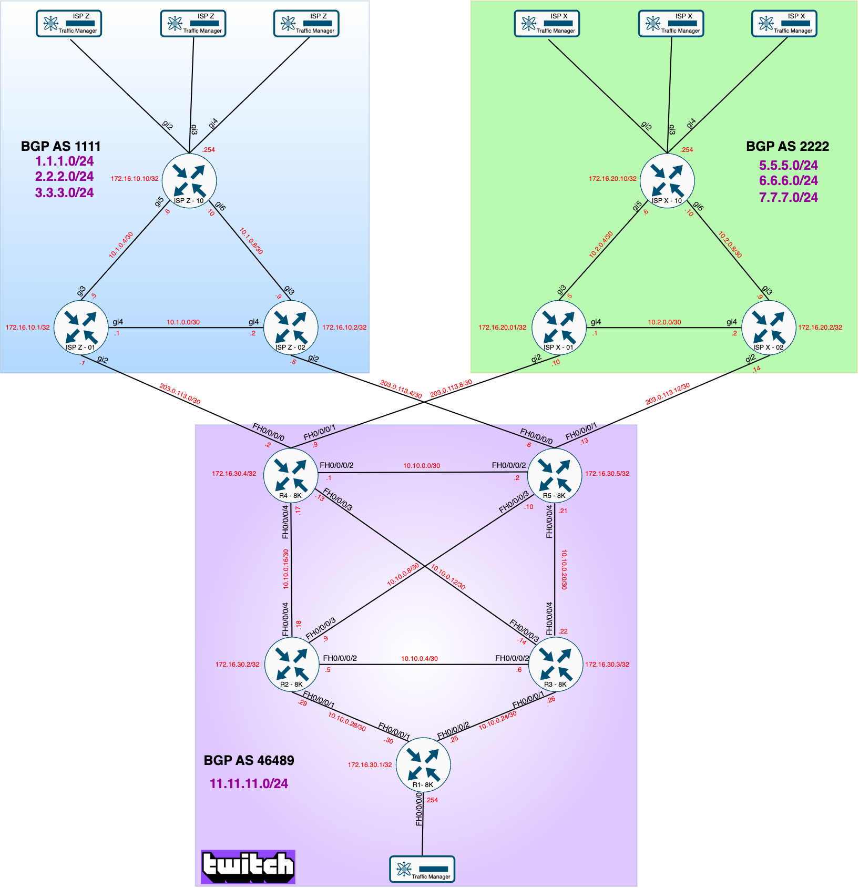
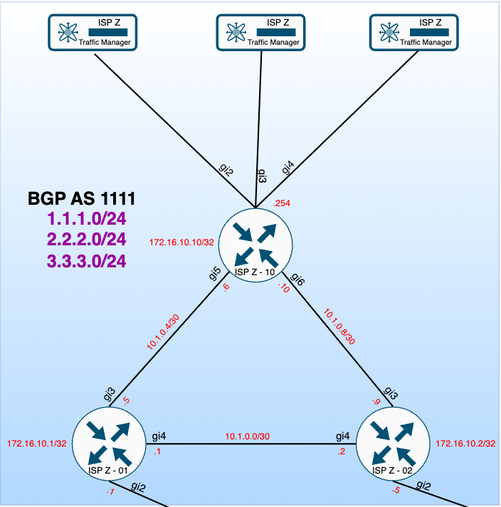
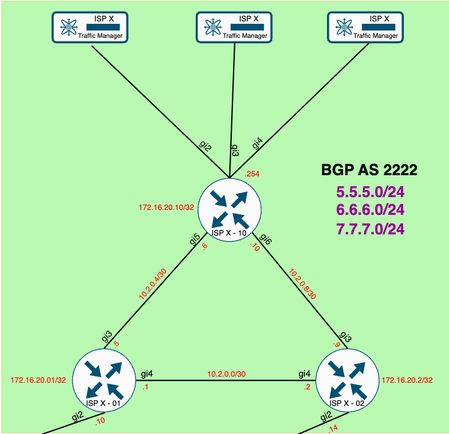
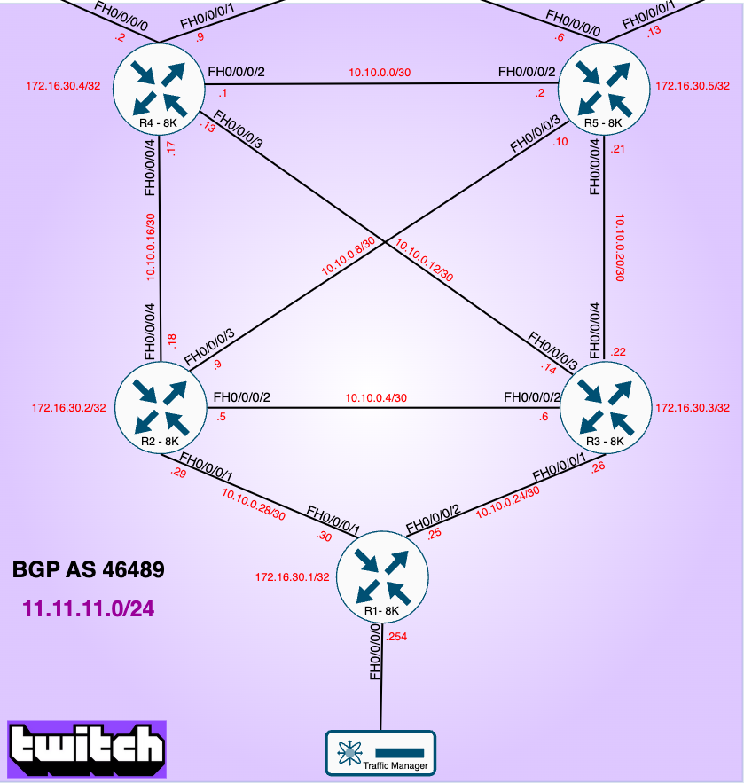
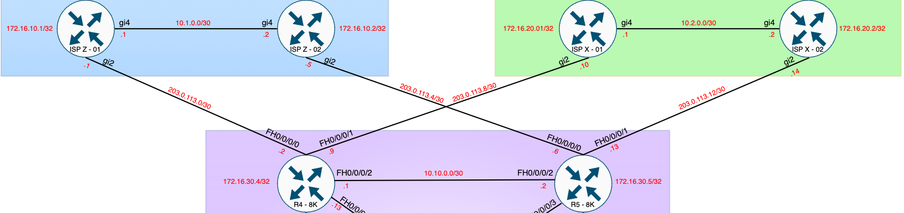
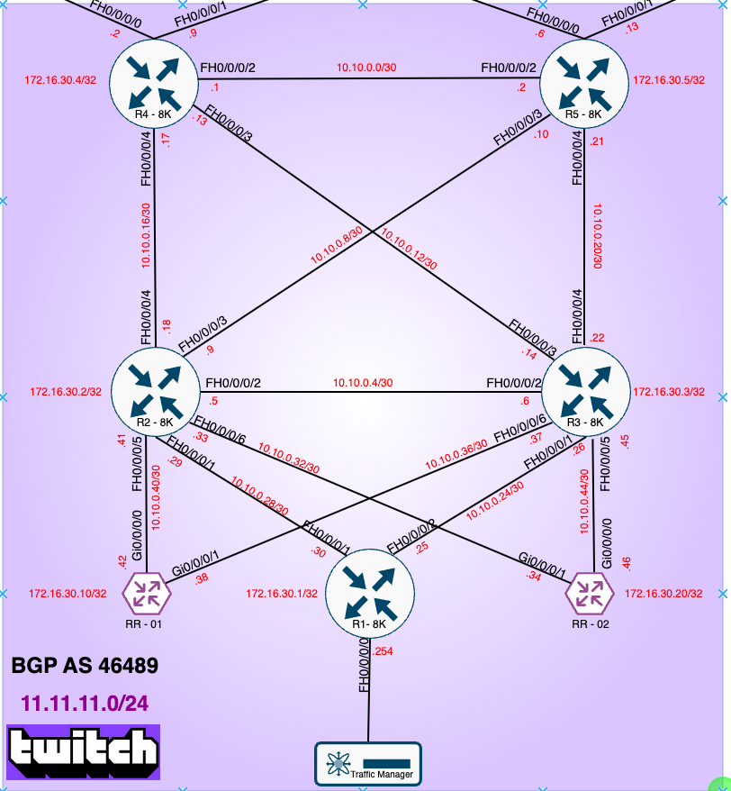

<span style="margin-right: 100px;"></span> <!-- Adjust the 20px to whatever space you need -->
 


<br>

# Twitch - BGP Peering ECMP with Cisco 8000


## Contact Information
  
- [Nicolas Michel, Solution Architect](nicmcl@cisco.com)


## Revision History - Changelog

Document any changes made to the lab setup, including updates to configurations, hardware changes, or topology modifications.

v1.0 : Twitch BGP ECMP architecture working without route reflectors<br>
v2.0 : Twitch BGP ECMP architecture working with route reflectors 

| Date       | Description                                    | Author         |
|------------|------------------------------------------------|----------------|
| 2024-09-24 | Initial document revision                      | Nicolas MICHEL |
| 2024-10-12 | Scripting                                      | Nicolas MICHEL |
| 2024-10-20 | Added Topology                                 | Nicolas MICHEL |
| 2024-11-04 | Revision - wording                             | Nicolas MICHEL |
| 2024-11-25 | Automation                                     | Nicolas MICHEL |
| 2024-12-4  | Route Reflector validation                     | Nicolas MICHEL |

*Last Updated: [2024-12-04]*

Pandoc will be used to convert this markdown into HTML

```
  pandoc Twitch-BGP-ECMP.md -c style.css --self-contained -o Twitch-BGP-ECMP.html
```


## Lab Backlog

- Automation for the ping generator


## Introduction

The purpose of this proof of concept is to demonstrate how iBGP multipath can be leveraged to achieve Equal-Cost Multi-Path (ECMP) for outbound traffic within a BGP autonomous system (AS).

This document outlines the different steps required to enable connectivity between the various Autonomous Systems (AS) using eBGP for external routing and iBGP for internal routing within each AS. OSPF is implemented within each AS to ensure loopback reachability and provide reliable routing for internal traffic.

## Lab Access

The lab is accessible through VPN with the following information:

- URL : https://dcloud-rtp-anyconnect.cisco.com
- user: v1447user10
- password: 585282

Once connected, the cisco routers will be reachable through SSH with the following ports configuration and credentials:

- user: twitch-eng
- password: twitch-eng!


| #   | Container Name                    | Type          | IPv4 Address     | SSH Port |
|-----|-----------------------------------|---------------|------------------|----------|
| 1   | clab-twitch-ebgp-ispx-01          | cisco_c8000v  | 198.18.140.10    | 2222     |
| 2   | clab-twitch-ebgp-ispx-02          | cisco_c8000v  | 198.18.140.10    | 2223     |
| 3   | clab-twitch-ebgp-ispx-10          | cisco_c8000v  | 198.18.140.10    | 2224     |
| 4   | clab-twitch-ebgp-ispz-01          | cisco_c8000v  | 198.18.140.10    | 2225     |
| 5   | clab-twitch-ebgp-ispz-02          | cisco_c8000v  | 198.18.140.10    | 2226     |
| 6   | clab-twitch-ebgp-ispz-10          | cisco_c8000v  | 198.18.140.10    | 2227     |
| 7   | clab-twitch-ebgp-twitch-r1        | cisco_c8000   | 198.18.140.10    | 2228     |
| 8   | clab-twitch-ebgp-twitch-r2        | cisco_c8000   | 198.18.140.10    | 2229     |
| 9   | clab-twitch-ebgp-twitch-r3        | cisco_c8000   | 198.18.140.10    | 2230     |
| 10  | clab-twitch-ebgp-twitch-r4        | cisco_c8000   | 198.18.140.10    | 2231     |
| 11  | clab-twitch-ebgp-twitch-r5        | cisco_c8000   | 198.18.140.10    | 2232     |
| 12  | clab-twitch-ebgp-twitch-xrd-rr-01 | cisco_xrd     | 198.18.140.10    | 2233     |
| 13  | clab-twitch-ebgp-twitch-xrd-rr-02 | cisco_xrd     | 198.18.140.10    | 2234     |

> **Note:** Use SSH credentials to access the containers via their respective ports.

the twitch linux container is automatically generating traffic to the remote linux containers.

## Phase 1 Overview

The initial phase of the project is executed without the use of BGP Route Reflectors within the Twitch Autonomous System (AS 46489). Traffic from AS 46489 to AS 1111 will be load-balanced through R4 and R5, the eBGP peering routers. This allows AS 46489 to effectively distribute its outbound traffic across multiple links when communicating with AS 1111, improving both bandwidth utilization and redundancy.

However, traffic destined for AS 2222 will not benefit from ECMP in this design. Instead, all traffic from AS 46489 to AS 2222 will be routed specifically through R5, ensuring a controlled path and simplifying the routing policy for this particular communication.


##  Twitch BGP Topology - Phase One - No Router Reflector


Here is a diagram that represents the Twitch BGP topology that we deployed in our lab.
 


The provided topology consists of three autonomous systems (AS) using BGP for routing between them and iBGP within each AS. OSPF is deployed as the interior gateway protocol (IGP) in each AS for internal loopback reachability, which ensures the iBGP neighbors can communicate.

Key Details - Autonomous systems:

	•	AS 1111 (Blue section) - ISP Z
	•	AS 2222 (Red section) - ISP X
	•	AS 46489 (Green section) - Twitch

	•	eBGP (External BGP) is used to exchange routes between these autonomous systems. 
	•	iBGP (Internal BGP) is used within each AS to propagate routes between routers internally. iBGP multipath is configured on each routers of the Twitch Autonomous System
	•	OSPF (Open Shortest Path First) is the IGP used in each AS to distribute loopback reachability for iBGP and ECMP towards the BGP next-hop interfaces

### OSPF Architecture.

The OSPF design is straightforward, with all links configured to have equal bandwidth reference. This ensures that traffic can be distributed evenly across multiple paths for load balancing and redundancy. 
OSPF is enabled on all internal interfaces, as well as the loopback interfaces on every router. 
The loopback interfaces are crucial for establishing iBGP peerings, as they provide stable endpoints for BGP sessions, even if physical interfaces experience issues. 
By using OSPF to advertise loopback reachability, the routers can maintain consistent internal routing, and the network can achieve efficient route propagation and high availability. This foundational setup helps streamline network operations and prepares the infrastructure for future scaling and additional features such as route reflectors.

While the primary focus of this topology is BGP, the OSPF configuration plays a critical role in supporting BGP Equal-Cost Multi-Path (ECMP) on the internal routers. OSPF ensures that the loopback interfaces of the BGP routers, which act as the BGP next hops for each advertised prefix, are reachable. This reliable loopback reachability provided by OSPF directly influences the ability of BGP to perform ECMP, enabling efficient load balancing across multiple paths within the network. This will have a critical impact on BGP ECMP within the Twitch Autononomous AS.

Here is an example of the OSPF configuration applied to router ispz-10
```
router ospf 1
 network 10.1.0.4 0.0.0.3 area 0
 network 10.1.0.8 0.0.0.3 area 0
 network 172.16.10.10 0.0.0.0 area 0
```

### BGP Autonomous System (AS) introduction: 

#### BGP AS 1111 - ISP Z (Blue Section) Introduction

IP Prefixes Advertised:

	•	1.1.1.0/24: Docker container subnet, with specific container IP address 1.1.1.1/24.
	•	2.2.2.0/24: Docker container subnet, with specific container IP address 2.2.2.2/24.
	•	3.3.3.0/24: Docker container subnet, with specific container IP address 3.3.3.3/24.

OSPF for Internal Reachability:

To support iBGP, OSPF is deployed internally within AS 1111 to provide loopback reachability. Each router’s loopback interface is used as the source for iBGP sessions, and OSPF ensures that all routers can reliably reach one another’s loopbacks. This design simplifies routing and ensures that iBGP sessions remain stable, even if physical interfaces or links experience issues. OSPF also plays a role in maintaining consistent internal routing and preparing the network for future scaling or modifications.
  
Router Infrastructure:

All routers within BGP AS 1111 are Catalyst 8Kv virtual routers. These routers form a fully meshed iBGP topology, ensuring complete route propagation across the entire AS. The iBGP full mesh allows each router to directly exchange routing information, facilitating efficient route dissemination without the need for route reflectors in this phase of the deployment.

Internal and External Routing Roles:

	•	ISP-Z-10 serves as an internal iBGP router, acting as the default gateway for the subnets 1.1.1.0/24, 2.2.2.0/24, and 3.3.3.0/24. All Docker containers are connected to this router, making it a critical component for local routing within AS 1111. ISP-Z-10 peers with all other routers in the AS via iBGP.
	•	ISP-Z-01 and ISP-Z-02 function as eBGP peering routers. These routers establish external BGP sessions with AS 46489, exchanging routing information between the two ASes. Internally, they are also part of the iBGP full mesh, ensuring that any routes learned from external ASes are propagated throughout AS 1111.


In summary, AS 1111 is designed with both internal (iBGP and OSPF) and external (eBGP) routing considerations, supporting Docker container subnets while maintaining robust connectivity to external Autonomous Systems.




#### BGP AS 2222 - ISP X (Green Section) Introduction

IP Prefixes Advertised:

	•	5.5.5.0/24: Docker container subnet, with specific container IP address 5.5.5.5/24.
	•	6.6.6.0/24: Docker container subnet, with specific container IP address 6.6.6.6/24.
	•	7.7.7.0/24: Docker container subnet, with specific container IP address 7.7.7.7/24.
  
OSPF for Internal Reachability:

To support iBGP, OSPF is deployed internally within AS 2222 to provide loopback reachability. Each router’s loopback interface is used as the source for iBGP sessions, and OSPF ensures that all routers can reliably reach one another’s loopbacks. This design simplifies routing and ensures that iBGP sessions remain stable, even if physical interfaces or links experience issues. OSPF also plays a role in maintaining consistent internal routing and preparing the network for future scaling or modifications.

Router Infrastructure:

All routers within BGP AS 2222 are Catalyst 8Kv virtual routers. These routers form a fully meshed iBGP topology, ensuring complete route propagation across the entire AS. The iBGP full mesh allows each router to directly exchange routing information, facilitating efficient route dissemination without the need for route reflectors in this phase of the deployment.

Internal and External Routing Roles:

	•	ISP-X-10 serves as an internal iBGP router, acting as the default gateway for the subnets 5.5.5.0/24, 6.6.6.0/24 and 7.7.7.0/24. All Docker containers are connected to this router, making it a critical component for local routing within AS 1111. ISP-Z-10 peers with all other routers in the AS via iBGP.
	•	ISP-X-01 and ISP-X-02 function as eBGP peering routers. These routers establish external BGP sessions with AS 46489, exchanging routing information between the two ASes. Internally, they are also part of the iBGP full mesh, ensuring that any routes learned from external ASes are propagated throughout AS 2222.


In summary, AS 2222 is designed with both internal (iBGP and OSPF) and external (eBGP) routing considerations, supporting Docker container subnets while maintaining robust connectivity to external Autonomous Systems.




#### BGP AS 46489 - ISP Twitch (Purple Section) Introduction

IP Prefixes Advertised: 
	•	11.11.11.0/24: Docker container subnet, with specific container IP address 11.11.11.11/24.


OSPF for Internal Reachability:

To support iBGP, OSPF is deployed internally within AS 46489 to provide loopback reachability. Each router’s loopback interface is used as the source for iBGP sessions, and OSPF ensures that all routers can reliably reach one another’s loopbacks. This design simplifies routing and ensures that iBGP sessions remain stable, even if physical interfaces or links experience issues. OSPF also plays a role in maintaining consistent internal routing and preparing the network for future scaling or modifications.

All Routers in this Autonomous Systems are Cisco 8000 Routers and run IOS-XR version [24.1.1 Release Notes](https://www.cisco.com/c/en/us/td/docs/iosxr/cisco8000/general/24xx/release/notes/b-release-notes-cisco8k-r2411.html)


Here are the OSPF configuration and verifications:

R1:

```
RP/0/RP0/CPU0:twitch-r1#show run router ospf
Tue Sep 24 23:41:32.394 UTC
router ospf 1
 router-id 172.16.30.1
 area 0
  interface Loopback0
  !
  interface FourHundredGigE0/0/0/1
  !
  interface FourHundredGigE0/0/0/2

```


R2:

```
RP/0/RP0/CPU0:twitch-r1#show run router ospf
Tue Sep 24 23:41:32.394 UTC
router ospf 1
 router-id 172.16.30.1
 area 0
  interface Loopback0
  !
  interface FourHundredGigE0/0/0/1
  !
  interface FourHundredGigE0/0/0/2
```

R3:

```
RP/0/RP0/CPU0:twitch-r3#show run router ospf
Tue Sep 24 23:42:39.825 UTC
router ospf 1
 router-id 172.16.30.3
 area 0
  interface Loopback0
  !
  interface FourHundredGigE0/0/0/1
  !
  interface FourHundredGigE0/0/0/2
  !
  interface FourHundredGigE0/0/0/3
  !
  interface FourHundredGigE0/0/0/4
```


R4:

```
RP/0/RP0/CPU0:twitch-r4#show run router ospf
Tue Sep 24 23:42:53.202 UTC
router ospf 1
 router-id 172.16.30.4
 area 0
  interface Loopback0
  !
  interface FourHundredGigE0/0/0/2
  !
  interface FourHundredGigE0/0/0/3
  !
  interface FourHundredGigE0/0/0/4
```

R5:

```
RP/0/RP0/CPU0:twitch-r5#show run router ospf
Tue Sep 24 23:44:28.626 UTC
router ospf 1
 router-id 172.16.30.5
 area 0
  interface Loopback0
  !
  interface FourHundredGigE0/0/0/2
  !
  interface FourHundredGigE0/0/0/3
  !
  interface FourHundredGigE0/0/0/4
```

The OSPF configuration in this setup is intentionally straightforward, designed primarily to ensure connectivity between the loopback interfaces of each router. This allows iBGP peering to be established seamlessly across the autonomous system. By default, OSPF applies the same cost to all interfaces, as they share the same bandwidth reference—400G in this case. This uniform cost structure enables Equal-Cost Multi-Path (ECMP) routing to be leveraged without any manual intervention. For example, on R1, OSPF will naturally distribute traffic evenly between both R4 and R5, demonstrating the effectiveness of OSPF’s default ECMP behavior and configuration in this environment.


IP OSPF Database for 172.16.30.4 on R1:

```
RP/0/RP0/CPU0:twitch-r1#show ip ospf database router 172.16.30.4
Tue Sep 24 23:49:56.542 UTC


            OSPF Router with ID (172.16.30.1) (Process ID 1)

                Router Link States (Area 0)

  Routing Bit Set on this LSA
  LS age: 745
  Options: (No TOS-capability, DC)
  LS Type: Router Links
  Link State ID: 172.16.30.4
  Advertising Router: 172.16.30.4
  LS Seq Number: 800000c1
  Checksum: 0x6b81
  Length: 72
   Number of Links: 4

    Link connected to: a Stub Network
     (Link ID) Network/subnet number: 172.16.30.4
     (Link Data) Network Mask: 255.255.255.255
      Number of TOS metrics: 0
       TOS 0 Metrics: 1

    Link connected to: a Transit Network
     (Link ID) Designated Router address: 10.10.0.1
     (Link Data) Router Interface address: 10.10.0.1
      Number of TOS metrics: 0
       TOS 0 Metrics: 1

    Link connected to: a Transit Network
     (Link ID) Designated Router address: 10.10.0.13
     (Link Data) Router Interface address: 10.10.0.13
      Number of TOS metrics: 0
       TOS 0 Metrics: 1

    Link connected to: a Transit Network
     (Link ID) Designated Router address: 10.10.0.18
     (Link Data) Router Interface address: 10.10.0.17
      Number of TOS metrics: 0
       TOS 0 Metrics: 1
```

IP OSPF Database for 172.16.30.5 on R1:

```
RP/0/RP0/CPU0:twitch-r1#show ip ospf database router 172.16.30.5
Tue Sep 24 23:50:46.667 UTC


            OSPF Router with ID (172.16.30.1) (Process ID 1)

                Router Link States (Area 0)

  Routing Bit Set on this LSA
  LS age: 876
  Options: (No TOS-capability, DC)
  LS Type: Router Links
  Link State ID: 172.16.30.5
  Advertising Router: 172.16.30.5
  LS Seq Number: 800000bf
  Checksum: 0xdb0f
  Length: 72
   Number of Links: 4

    Link connected to: a Stub Network
     (Link ID) Network/subnet number: 172.16.30.5
     (Link Data) Network Mask: 255.255.255.255
      Number of TOS metrics: 0
       TOS 0 Metrics: 1

    Link connected to: a Transit Network
     (Link ID) Designated Router address: 10.10.0.1
     (Link Data) Router Interface address: 10.10.0.2
      Number of TOS metrics: 0
       TOS 0 Metrics: 1

    Link connected to: a Transit Network
     (Link ID) Designated Router address: 10.10.0.9
     (Link Data) Router Interface address: 10.10.0.10
      Number of TOS metrics: 0
       TOS 0 Metrics: 1

    Link connected to: a Transit Network
     (Link ID) Designated Router address: 10.10.0.21
     (Link Data) Router Interface address: 10.10.0.21
      Number of TOS metrics: 0
       TOS 0 Metrics: 1
```

ECMP verification for R4 and R5 Loopback interfaces on R1:

show ip route  and show ip cef for 172.16.30.4 on R1:

```
RP/0/RP0/CPU0:twitch-r1#show ip route 172.16.30.4
Tue Sep 24 23:52:16.666 UTC

Routing entry for 172.16.30.4/32
  Known via "ospf 1", distance 110, metric 3, type intra area
  Installed Sep 22 02:44:01.533 for 2d21h
  Routing Descriptor Blocks
    10.10.0.26, from 172.16.30.4, via FourHundredGigE0/0/0/2
      Route metric is 3
    10.10.0.29, from 172.16.30.4, via FourHundredGigE0/0/0/1
      Route metric is 3
  No advertising protos.


RP/0/RP0/CPU0:twitch-r1#show ip cef 172.16.30.4
Tue Sep 24 23:51:53.746 UTC
172.16.30.4/32, version 26, internal 0x1000001 0x10 (ptr 0xa3ef9aa8) [3], 0x400 (0xa3ec6a28), 0x0 (0x0)
 Updated Sep 22 02:44:01.535
 local adjacency to FourHundredGigE0/0/0/2

 Prefix Len 32, traffic index 0, precedence n/a, priority 1
  gateway array (0xa3d50348) reference count 4, flags 0x0, source rib (7), 0 backups
                [5 type 3 flags 0x8401 (0xa3e1f838) ext 0x0 (0x0)]
  LW-LDI[type=3, refc=1, ptr=0xa3ec6a28, sh-ldi=0xa3e1f838]
  gateway array update type-time 1 Sep 22 02:44:01.536
 LDI Update time Sep 22 02:44:01.536
 LW-LDI-TS Sep 22 02:44:01.536
   via 10.10.0.26/32, FourHundredGigE0/0/0/2, 7 dependencies, weight 0, class 0 [flags 0x0]
    path-idx 0 NHID 0x0 [0xb7f99208 0x0]
    next hop 10.10.0.26/32
    local adjacency
   via 10.10.0.29/32, FourHundredGigE0/0/0/1, 7 dependencies, weight 0, class 0 [flags 0x0]
    path-idx 1 NHID 0x0 [0xb7f99370 0x0]
    next hop 10.10.0.29/32
    local adjacency

    Load distribution: 0 1 (refcount 5)

    Hash  OK  Interface                 Address
    0     Y   FourHundredGigE0/0/0/2    10.10.0.26
    1     Y   FourHundredGigE0/0/0/1    10.10.0.29


```


show ip route and show ip cef for 172.16.30.5 on R1:

```

RP/0/RP0/CPU0:twitch-r1#show ip route 172.16.30.5
Tue Sep 24 23:53:25.443 UTC

Routing entry for 172.16.30.5/32
  Known via "ospf 1", distance 110, metric 3, type intra area
  Installed Sep 22 02:44:01.533 for 2d21h
  Routing Descriptor Blocks
    10.10.0.26, from 172.16.30.5, via FourHundredGigE0/0/0/2
      Route metric is 3
    10.10.0.29, from 172.16.30.5, via FourHundredGigE0/0/0/1
      Route metric is 3
  No advertising protos.


RP/0/RP0/CPU0:twitch-r1#show ip cef 172.16.30.5
Tue Sep 24 23:54:04.810 UTC
172.16.30.5/32, version 27, internal 0x1000001 0x10 (ptr 0xa3ef9ba8) [5], 0x400 (0xa3ec6b58), 0x0 (0x0)
 Updated Sep 22 02:44:01.535
 local adjacency to FourHundredGigE0/0/0/2

 Prefix Len 32, traffic index 0, precedence n/a, priority 1
  gateway array (0xa3d50348) reference count 4, flags 0x0, source rib (7), 0 backups
                [5 type 3 flags 0x8401 (0xa3e1f838) ext 0x0 (0x0)]
  LW-LDI[type=3, refc=1, ptr=0xa3ec6b58, sh-ldi=0xa3e1f838]
  gateway array update type-time 1 Sep 22 02:44:01.536
 LDI Update time Sep 22 02:44:01.536
 LW-LDI-TS Sep 22 02:44:01.536
   via 10.10.0.26/32, FourHundredGigE0/0/0/2, 7 dependencies, weight 0, class 0 [flags 0x0]
    path-idx 0 NHID 0x0 [0xb7f99208 0x0]
    next hop 10.10.0.26/32
    local adjacency
   via 10.10.0.29/32, FourHundredGigE0/0/0/1, 7 dependencies, weight 0, class 0 [flags 0x0]
    path-idx 1 NHID 0x0 [0xb7f99370 0x0]
    next hop 10.10.0.29/32
    local adjacency

    Load distribution: 0 1 (refcount 5)

    Hash  OK  Interface                 Address
    0     Y   FourHundredGigE0/0/0/2    10.10.0.26
    1     Y   FourHundredGigE0/0/0/1    10.10.0.29  

```

In this scenario, Equal-Cost Multi-Path (ECMP) has been successfully configured and achieved for the loopback interfaces of iBGP peers within the Twitch AS. The OSPF routing protocol has been used internally to ensure that the loopback interfaces of each BGP router are reachable, which is critical for iBGP peering.

----
OSPF Route to iBGP Peers:
The show ip route command for loopback addresses 172.16.30.4/32 and 172.16.30.5/32 on R1 shows that OSPF is advertising these routes with a metric of 3 via two equal-cost paths:
Path 1: 10.10.0.26 via interface FourHundredGigE0/0/0/2
Path 2: 10.10.0.29 via interface FourHundredGigE0/0/0/1
This indicates that R1 has multiple, equal-cost paths to reach the loopback addresses of the BGP routers (R4 and R5).

----
Load Sharing with CEF (Cisco Express Forwarding):
The show ip cef command confirms that load balancing across these two paths is active.
Both paths are utilized for traffic distribution, demonstrating that ECMP is functioning as expected. For instance:
R1 splits traffic between 10.10.0.26 and 10.10.0.29 interfaces based on load distribution.
BGP Next-Hop:
The BGP next-hop addresses (172.16.30.4 and 172.16.30.5) are resolved via the OSPF-learned routes. This allows BGP to forward traffic to either R4 or R5, ensuring efficient load balancing for outbound traffic from AS 46489 to AS 1111.

Traffic is distributed evenly between R4 and R5, making full use of the available bandwidth on both links. Should one path fail, the other path will continue to carry traffic, providing fault tolerance.

Now that the foundations for iBGP are implemented, we can study the iBGP and eBGP configuration implemented on the Twitch Routers




#  EBGP AS 46489 - ISP Twitch (Purple Section)


# Route Policy R4 

In IOS-XR, a route policy is a flexible mechanism used to control routing information, allowing network administrators to manipulate incoming and outgoing routes in a granular way. Route policies are defined using Routing Policy Language (RPL), which provides a rich set of tools to match specific prefixes, next-hops, communities, and other route attributes.

The policies can be applied to routes during BGP updates . Key functions of a route policy include filtering routes, modifying attributes such as route-metrics, local-preference, AS-path, and communities, or enabling special actions like setting a next-hop address. IOS-XR allows for highly customizable route filtering and manipulation, ensuring that routing decisions align with network design goals.

On R4

```
route-policy ALLOW
  pass
end-policy
```
This is a very basic policy. The ALLOW route policy simply permits all routes to pass through without any modifications or filtering. It is essentially a pass-all policy, meaning it allows all routes to be accepted or advertised without applying any specific conditions or changes.


```
route-policy TAG_ALL_1111
  set community (1111:1111) additive
  pass
end-policy
```
The TAG_ALL_1111 route policy assigns the BGP community value 1111:1111 to all routes that pass through it. The keyword additive ensures that this community is added to any existing communities on the route rather than replacing them. After tagging the route with the community, the policy passes the route along.


```
route-policy TAG_ALL_2222
  set community (2222:2222) additive
  pass
end-policy
```
The TAG_ALL_2222 route policy works similarly to the previous policy, except that it assigns the community value 2222:2222. This community is also added to any existing communities without replacing them.


```
route-policy TAG_ALL_TWITCH
  set community 46489:46489 additive
  pass
end-policy
```
The TAG_ALL_TWITCH route policy sets the community value 46489:46489 for all routes passing through it. Like the other tagging policies, it uses the additive keyword to ensure that this community is added on top of any existing ones.


```
route-policy OUTBOUND_NO_TRANSIT
  if not as-path is-local then
    drop
  else
    pass
  endif
end-policy
```
The OUTBOUND_NO_TRANSIT route policy ensures that Twitch AS (AS 46489) does not act as a transit AS. It inspects the AS-path attribute of the route. If the AS-path is not local (i.e., the route does not originate from the local AS), it drops the route. Otherwise, if the route originates from the local AS, it passes the route.


# Route Policy R5 

R5 has similar Route Policies than R4 with the addition of the following policy that will influence traffic that is destined to ISP-X AS 2222 and that will be steered by R5 within the entire AS 46489:


```
route-policy LOCAL_PREF_150_TAG_2222
  set community (2222:2222) additive
  set local-preference 150
  pass
end-policy
```

This route policy will add the community 2222:2222 to the BGP Updates processed. This is community addition is performed for classification usage and has no impact on the actual ECMP usage.
The local-preference attribute is a BGP path selection attribute used within an Autonomous System (AS) to choose the best path to reach a destination. A higher local preference value makes the route more preferred. The default local preference in BGP is typically 100, but this policy sets it to 150, making it a more preferred route compared to others with lower local preference values.
By setting the local preference to 150, this policy ensures that routes processed by this policy will be preferred over other routes within the same AS that have a default or lower local preference. This will be used for internal traffic engineering, where we want certain routes to be sent via R5 instead of R4.
In the case of an outage on R5, the routes are still advertised in the BGP Austonomous System 46489 with a local preference of 100 by R4. The traffic will be sent to R4 at this point and convergence will be based on BGP timers or BFD if implemented.

In summary:

This policy could be used in scenarios where we want to prefer traffic through specific routes associated with AS 2222 by increasing their local preference and marking them for identification using the 2222:2222 community tag. It can influence both the internal routing decision process and allow external BGP peers to use community-based filtering or routing decisions based on the tag.


# EBGP within the Twitch Autonomous System. 

Let’s focus on the E-BGP peering relationships on R4 and R5. In this scenario, it is critical to ensure that the Twitch Autonomous System (AS 46489) does not act as a transit AS. A transit AS is a network that allows data to pass through it from one external AS to another, effectively routing traffic between third-party networks.

To prevent the Twitch AS from becoming a transit network, we need to control the advertisement of routes between the external peers in AS 1111 and AS 2222. Specifically, we can implement route policies on R4 and R5 that restrict the advertisement of routes learned from AS 1111 to AS 2222, and vice versa. This will ensure that Twitch AS only forwards traffic destined for its own network and not traffic that merely passes through from one external AS to another.

Additionally, proper BGP filtering mechanisms should be applied, such as the use of BGP route maps or prefix lists, to explicitly permit or deny certain routes from being advertised between peers. These configurations prevent Twitch AS from inadvertently allowing traffic from AS 1111 to transit through R4 and R5 to reach AS 2222 (and vice versa), thus avoiding the role of a transit network while maintaining control over its own outbound and inbound traffic policies.

By carefully managing route advertisements, Twitch AS will maintain its intended routing policy without inadvertently becoming a transit AS for other networks.


	

BGP Configuration on R4
```
RP/0/RP0/CPU0:twitch-r4#show run router bgp
Wed Sep 25 00:36:11.915 UTC
router bgp 46489
 bgp router-id 172.16.30.4
 address-family ipv4 unicast
  maximum-paths ibgp 128
 !
 neighbor 172.16.30.1
  remote-as 46489
  update-source Loopback0
  address-family ipv4 unicast
   next-hop-self
   route-policy ALLOW in
   route-policy ALLOW out
   soft-reconfiguration inbound
  !
 !
 neighbor 172.16.30.2
  remote-as 46489
  update-source Loopback0
  address-family ipv4 unicast
   next-hop-self
   route-policy ALLOW in
   route-policy ALLOW out
   soft-reconfiguration inbound
  !
 !
 neighbor 172.16.30.3
  remote-as 46489
  update-source Loopback0
  address-family ipv4 unicast
   next-hop-self
   route-policy ALLOW in
   route-policy ALLOW out
   soft-reconfiguration inbound
  !
 !
 neighbor 172.16.30.5
  remote-as 46489
  update-source Loopback0
  address-family ipv4 unicast
   next-hop-self
   route-policy ALLOW in
   route-policy ALLOW out
   soft-reconfiguration inbound
  !
 !
 neighbor 203.0.113.1
  remote-as 1111
  address-family ipv4 unicast
   route-policy TAG_ALL_1111 in
   route-policy OUTBOUND_NO_TRANSIT out
   soft-reconfiguration inbound always
  !
 !
 neighbor 203.0.113.10
  remote-as 2222
  address-family ipv4 unicast
   route-policy TAG_ALL_2222 in
   route-policy OUTBOUND_NO_TRANSIT out
   soft-reconfiguration inbound

```

BGP Configuration on R5
```

RP/0/RP0/CPU0:twitch-r5#show run router bgp
Wed Sep 25 00:36:32.840 UTC
router bgp 46489
 bgp router-id 172.16.30.5
 address-family ipv4 unicast
  maximum-paths ibgp 128
 !
 neighbor 172.16.30.1
  remote-as 46489
  update-source Loopback0
  address-family ipv4 unicast
   next-hop-self
   route-policy ALLOW in
   route-policy ALLOW out
   soft-reconfiguration inbound
  !
 !
 neighbor 172.16.30.2
  remote-as 46489
  update-source Loopback0
  address-family ipv4 unicast
   next-hop-self
   route-policy ALLOW in
   route-policy ALLOW out
   soft-reconfiguration inbound
  !
 !
 neighbor 172.16.30.3
  remote-as 46489
  update-source Loopback0
  address-family ipv4 unicast
   next-hop-self
   route-policy ALLOW in
   route-policy ALLOW out
   soft-reconfiguration inbound
  !
 !
 neighbor 172.16.30.4
  remote-as 46489
  update-source Loopback0
  address-family ipv4 unicast
   next-hop-self
   route-policy ALLOW in
   route-policy ALLOW out
   soft-reconfiguration inbound
  !
 !
 neighbor 203.0.113.5
  remote-as 1111
  address-family ipv4 unicast
   route-policy TAG_ALL_1111 in
   route-policy OUTBOUND_NO_TRANSIT out
   soft-reconfiguration inbound
  !
 !
 neighbor 203.0.113.14
  remote-as 2222
  address-family ipv4 unicast
   route-policy LOCAL_PREF_150_TAG_2222 in
   route-policy OUTBOUND_NO_TRANSIT out
   soft-reconfiguration inbound
```


We can see both iBGP and eBGP peering established 

On R4
```
RP/0/RP0/CPU0:twitch-r4#show ip bgp summary
Wed Sep 25 00:37:18.007 UTC
BGP router identifier 172.16.30.4, local AS number 46489
BGP generic scan interval 60 secs
Non-stop routing is enabled
BGP table state: Active
Table ID: 0xe0000000   RD version: 147
BGP table nexthop route policy:
BGP main routing table version 147
BGP NSR Initial initsync version 9 (Reached)
BGP NSR/ISSU Sync-Group versions 0/0
BGP scan interval 60 secs

BGP is operating in STANDALONE mode.


Process    RcvTblVer     bRIB/RIB     LabelVer    ImportVer    SendTblVer   StandbyVer
Speaker          147           147           147           147           147             0

Neighbor        Spk    AS MsgRcvd MsgSent       TblVer  InQ OutQ  Up/Down  St/PfxRcd
172.16.30.1       0 46489    6264    6298          147    0    0    2d21h          1
172.16.30.2       0 46489    6263    6299          147    0    0    4d06h          0
172.16.30.3       0 46489    6262    6300          147    0    0    4d06h          0
172.16.30.5       0 46489    6295    6299          147    0    0    4d06h          6
203.0.113.1       0  1111    6919    6319          147    0    0    4d06h          3
203.0.113.10      0  2222    6908    6306          147    0    0    4d06h          3
```

on R5:

```
RP/0/RP0/CPU0:twitch-r5#show ip bgp summary
Wed Sep 25 00:37:29.270 UTC
BGP router identifier 172.16.30.5, local AS number 46489
BGP generic scan interval 60 secs
Non-stop routing is enabled
BGP table state: Active
Table ID: 0xe0000000   RD version: 136
BGP table nexthop route policy:
BGP main routing table version 136
BGP NSR Initial initsync version 9 (Reached)
BGP NSR/ISSU Sync-Group versions 0/0
BGP scan interval 60 secs

BGP is operating in STANDALONE mode.


Process    RcvTblVer     bRIB/RIB     LabelVer    ImportVer    SendTblVer   StandbyVer
Speaker          136           136           136           136           136             0

Neighbor        Spk    AS MsgRcvd MsgSent       TblVer  InQ OutQ  Up/Down  St/PfxRcd
172.16.30.1       0 46489    6258    6291          136    0    0    2d21h          1
172.16.30.2       0 46489    6258    6292          136    0    0    4d06h          0
172.16.30.3       0 46489    6259    6292          136    0    0    4d06h          0
172.16.30.4       0 46489    6297    6300          136    0    0    4d06h          3
203.0.113.5       0  1111    6893    6309          136    0    0    4d06h          3
203.0.113.14      0  2222    6890    6301          136    0    0    4d06h          3
```


## Phase 2 Overview

In the second phase of the project, BGP Route Reflectors will be introduced to optimize and simplify the iBGP topology within AS 46489. This addition will improve route dissemination, simplify network management, and enhance scalability, allowing the network to handle increased routing demands as the deployment grows.

The combination of iBGP multipath, ECMP, and the future integration of BGP Route Reflectors will create a scalable, redundant, and efficient routing architecture.

```
Disclaimer:

The topology and network design outlined in this document have been thoroughly discussed with the customer, including all routing protocols, BGP configurations, and connectivity details. The customer has provided input and approval for the architecture as represented. Any changes or modifications made to the topology after the discussions are based on the customer’s requirements and expectations. This document serves as a reference and is intended for internal use only. The customer assumes responsibility for the final implementation, and any unforeseen issues or deviations from the plan must be addressed in subsequent meetings. All proprietary and confidential information regarding the customer’s network infrastructure has been handled in accordance with privacy and data protection policies.

```

### Route reflector Topology 



This new phase describes the enhancements made to the BGP topology within Autonomous System (AS) 46489 with the introduction of two route reflectors (RR-01 and RR-02). The modifications aim to simplify the iBGP configuration, improve scalability, and ensure high availability without changing the underlying OSPF routing used for loopback address reachability. These changes pave the way for a more efficient, scalable, and manageable network design, particularly in large-scale environments with complex traffic requirements.

Previously, the BGP topology within AS 46489 relied on a full iBGP mesh between all routers (R1, R2, R3, R4, and R5). This design required every router to establish a BGP session with every other router in the AS. While this approach ensured route propagation, it had several limitations:

	•	Scalability Issues: The number of BGP sessions grows quadratically as the number of routers increases, creating significant overhead in larger networks.
	•	Resource Constraints: Each router needed to maintain multiple BGP sessions, consuming CPU and memory resources.
	•	Operational Complexity: Managing a full-mesh topology becomes cumbersome as the network grows.

To address these challenges, the new design introduces two route reflectors, RR-01 and RR-02, into the topology.


The deployment of RR-01 and RR-02 as route reflectors transforms the topology from a full mesh to a hierarchical model:

```
	1.	Route Reflector Clients: All routers (R1, R2, R3, R4, and R5) are now configured as clients of RR-01 and RR-02.
	2.	Route Reflection: The route reflectors manage the distribution of BGP updates among their clients, reducing the need for direct peering between the clients.
	3.	Redundancy: The use of two route reflectors ensures high availability and resiliency.
  4.  The route reflectors are not peering with each other 
```

### Route reflector introduction

BGP, as the de facto standard for inter-domain routing, relies on a full mesh of iBGP (internal BGP) peerings between all BGP speakers within an autonomous system. This full mesh approach ensures that every BGP speaker has a complete view of the routing information available in the network.
However, as the number of BGP speakers grows, maintaining this full mesh becomes increasingly complex and resource-intensive. This is where Route Reflectors come into play.
A Route Reflector is a BGP speaker that is configured to reflect routes it learns from one internal BGP peer to other internal BGP peers. By acting as a central hub, Route Reflectors eliminate the need for a full mesh of iBGP peerings, significantly simplifying the overall BGP topology.

Each router now establishes BGP sessions only with RR-01 and RR-02, drastically reducing the number of required sessions.
In the previous full-mesh design, the number of BGP sessions grew as  n(n-1)/2 , where  n  is the number of routers. With route reflectors, the number of sessions is reduced to  2n , enabling the network to scale seamlessly. New routers can be added as clients without affecting the topology’s complexity.

High Availability:

	•	The dual route reflector setup ensures that if one route reflector fails, the other continues to propagate BGP updates to all clients.
	•	Redundant sessions between the clients and both route reflectors provide resiliency against single points of failure


Centralized Policy Management:

	•	Route reflectors enable centralized management of BGP policies, such as route filtering, community tagging, and AS path prepending. This centralization simplifies policy enforcement and traffic engineering.


### Traffic Flow and Load Balancing

OSPF continues to be used as the underlay protocol to advertise loopback addresses. This ensures that all routers have reachability to the loopbacks, which are used as the next hops for BGP routes.
OSPF also facilitates equal-cost multipath (ECMP) load balancing, enabling efficient traffic distribution across multiple paths.

Route Propagation
BGP next-hop addresses remain unchanged during reflection, ensuring that traffic paths are determined based on the OSPF costs to the loopbacks.
The route reflectors ensure consistent route propagation to all clients, maintaining optimal traffic flow across the AS.


### iBGP Configuration for iBGP Client

The configuration is designed to optimize routing, enable multipath routing, and enforce specific policies for route handling. Below is a detailed explanation of the key components of the configuration (R4 configuration shown below):


```
router bgp 46489
 bgp router-id 172.16.30.4
 bgp bestpath as-path multipath-relax
 address-family ipv4 unicast
  maximum-paths ibgp 128
 !
 neighbor 203.0.113.1
  remote-as 1111
  address-family ipv4 unicast
   route-policy TAG_ALL_1111 in
   route-policy OUTBOUND_NO_TRANSIT out
   soft-reconfiguration inbound always
  !
 !
 neighbor 172.16.30.10
  remote-as 46489
  capability additional-paths receive
  capability additional-paths send
  update-source Loopback0
  address-family ipv4 unicast
   next-hop-self
   route-policy ALLOW in
   route-policy ALLOW out
   soft-reconfiguration inbound always
   additional-paths receive
   additional-paths send
  !
 !
 neighbor 172.16.30.20
  remote-as 46489
  capability additional-paths receive
  capability additional-paths send
  update-source Loopback0
  address-family ipv4 unicast
   next-hop-self
   route-policy ALLOW in
   route-policy ALLOW out
   soft-reconfiguration inbound always
   additional-paths receive
   additional-paths send
  !
 !
```


This iBGP configuration shows the peering of all internal routers towards the iBGP Route Reflector RR-01 and RR-02.
By default a route reflector will advertise a single path to its BGP Route reflector clients, it is important in this case to enable the multipath and additional path in the bgp configuration as shown above.


### iBGP Configuration for iBGP Client


The configuration below is applied to RR-01 

```


RP/0/RP0/CPU0:twitch-xrd-rr-01#show run router bgp
Fri Dec 13 23:27:18.227 UTC
router bgp 46489
 bgp router-id 172.16.30.10
 bgp bestpath as-path multipath-relax
 address-family ipv4 unicast
  additional-paths receive
  additional-paths send
  maximum-paths ibgp 64
  additional-paths selection route-policy ALLOW_MULTIPATH
 !
 neighbor 172.16.30.1
  remote-as 46489
  capability additional-paths receive
  capability additional-paths send
  update-source Loopback0
  address-family ipv4 unicast
   route-policy ALLOW in
   route-reflector-client
   route-policy ALLOW out
   soft-reconfiguration inbound
   additional-paths receive
   additional-paths send
  !
 !
 neighbor 172.16.30.2
  remote-as 46489
  capability additional-paths receive
  capability additional-paths send
  update-source Loopback0
  address-family ipv4 unicast
   route-policy ALLOW in
   route-reflector-client
   route-policy ALLOW out
   soft-reconfiguration inbound
   additional-paths receive
   additional-paths send
  !
 !
 neighbor 172.16.30.3
  remote-as 46489
  capability additional-paths receive
  capability additional-paths send
  update-source Loopback0
  address-family ipv4 unicast
   route-policy ALLOW in
   route-reflector-client
   route-policy ALLOW out
   soft-reconfiguration inbound
   additional-paths receive
   additional-paths send
  !
 !
 neighbor 172.16.30.4
  remote-as 46489
  capability additional-paths receive
  capability additional-paths send
  update-source Loopback0
  address-family ipv4 unicast
   route-policy ALLOW in
   route-reflector-client
   route-policy ALLOW out
   soft-reconfiguration inbound
   additional-paths receive
   additional-paths send
  !
 !
 neighbor 172.16.30.5
  remote-as 46489
  capability additional-paths receive
  capability additional-paths send
  update-source Loopback0
  address-family ipv4 unicast
   route-policy ALLOW in
   route-reflector-client
   route-policy ALLOW out
   soft-reconfiguration inbound
   additional-paths receive
   additional-paths send
  !
 !
!

RP/0/RP0/CPU0:twitch-xrd-rr-01#
```


A similar configuration is applied to RR-02

```

RP/0/RP0/CPU0:twitch-xrd-rr-02#show run router bgp
Fri Dec 13 23:28:17.237 UTC
router bgp 46489
 bgp router-id 172.16.30.20
 bgp bestpath as-path multipath-relax
 address-family ipv4 unicast
  additional-paths receive
  additional-paths send
  maximum-paths ibgp 64
  additional-paths selection route-policy ALLOW_MULTIPATH
 !
 neighbor 172.16.30.1
  remote-as 46489
  capability additional-paths receive
  capability additional-paths send
  update-source Loopback0
  address-family ipv4 unicast
   route-policy ALLOW in
   route-reflector-client
   route-policy ALLOW out
   soft-reconfiguration inbound
   additional-paths receive
   additional-paths send
  !
 !
 neighbor 172.16.30.2
  remote-as 46489
  capability additional-paths receive
  capability additional-paths send
  update-source Loopback0
  address-family ipv4 unicast
   route-policy ALLOW in
   route-reflector-client
   route-policy ALLOW out
   soft-reconfiguration inbound
   additional-paths receive
   additional-paths send
  !
 !
 neighbor 172.16.30.3
  remote-as 46489
  capability additional-paths receive
  capability additional-paths send
  update-source Loopback0
  address-family ipv4 unicast
   route-policy ALLOW in
   route-reflector-client
   route-policy ALLOW out
   soft-reconfiguration inbound
   additional-paths receive
   additional-paths send
  !
 !
 neighbor 172.16.30.4
  remote-as 46489
  capability additional-paths receive
  capability additional-paths send
  update-source Loopback0
  address-family ipv4 unicast
   route-policy ALLOW in
   route-reflector-client
   route-policy ALLOW out
   soft-reconfiguration inbound
   additional-paths receive
   additional-paths send
  !
 !
 neighbor 172.16.30.5
  remote-as 46489
  capability additional-paths receive
  capability additional-paths send
  update-source Loopback0
  address-family ipv4 unicast
   route-policy ALLOW in
   route-reflector-client
   route-policy ALLOW out
   soft-reconfiguration inbound
   additional-paths receive
   additional-paths send
  !
 !
!

RP/0/RP0/CPU0:twitch-xrd-rr-02#
```


### BGP Output on the route reflectors

The routers R1 to R5 will be shown as BGP peers in the following outputs for both route reflectors :


RR-01 : 
```
RP/0/RP0/CPU0:twitch-xrd-rr-01#show ip bgp summary
Fri Dec 13 23:29:36.860 UTC
BGP router identifier 172.16.30.10, local AS number 46489
BGP generic scan interval 60 secs
Non-stop routing is enabled
BGP table state: Active
Table ID: 0xe0000000   RD version: 14
BGP main routing table version 14
BGP NSR Initial initsync version 3 (Reached)
BGP NSR/ISSU Sync-Group versions 0/0
BGP scan interval 60 secs

BGP is operating in STANDALONE mode.


Process       RcvTblVer   bRIB/RIB   LabelVer  ImportVer  SendTblVer  StandbyVer
Speaker              14         14         14         14          14           0

Neighbor        Spk    AS MsgRcvd MsgSent   TblVer  InQ OutQ  Up/Down  St/PfxRcd
172.16.30.1       0 46489   11513   11517       14    0    0     1w0d          1
172.16.30.2       0 46489   11513   11518       14    0    0     1w0d          0
172.16.30.3       0 46489   11512   11517       14    0    0     1w0d          0
172.16.30.4       0 46489   11514   11516       14    0    0     1w0d          6
172.16.30.5       0 46489   11512   11516       14    0    0     1w0d          3


```

RR-02: 

```
RP/0/RP0/CPU0:twitch-xrd-rr-02#show ip bgp summary
Fri Dec 13 23:31:08.726 UTC
BGP router identifier 172.16.30.20, local AS number 46489
BGP generic scan interval 60 secs
Non-stop routing is enabled
BGP table state: Active
Table ID: 0xe0000000   RD version: 14
BGP main routing table version 14
BGP NSR Initial initsync version 3 (Reached)
BGP NSR/ISSU Sync-Group versions 0/0
BGP scan interval 60 secs

BGP is operating in STANDALONE mode.


Process       RcvTblVer   bRIB/RIB   LabelVer  ImportVer  SendTblVer  StandbyVer
Speaker              14         14         14         14          14           0

Neighbor        Spk    AS MsgRcvd MsgSent   TblVer  InQ OutQ  Up/Down  St/PfxRcd
172.16.30.1       0 46489   11514   11519       14    0    0     1w0d          1
172.16.30.2       0 46489   11514   11520       14    0    0     1w0d          0
172.16.30.3       0 46489   11514   11519       14    0    0     1w0d          0
172.16.30.4       0 46489   11515   11518       14    0    0     1w0d          6
172.16.30.5       0 46489   11514   11518       14    0    0     1w0d          3
```


The following output shows the show ip bgp for both route reflectors, we can see that it receives a multipath routes for the 1.1.1.0/24, 2.2.2.0/24 and 3.3.3.0/24 prefixes while the prefixes that belong to ISP 2222 are steered towards the next hop 172.16.30.5 thanks to a higher local preference configured on R5.


```
RP/0/RP0/CPU0:twitch-xrd-rr-01#show ip bgp
Fri Dec 13 23:40:57.815 UTC
BGP router identifier 172.16.30.10, local AS number 46489
BGP generic scan interval 60 secs
Non-stop routing is enabled
BGP table state: Active
Table ID: 0xe0000000   RD version: 17
BGP main routing table version 17
BGP NSR Initial initsync version 3 (Reached)
BGP NSR/ISSU Sync-Group versions 0/0
BGP scan interval 60 secs

Status codes: s suppressed, d damped, h history, * valid, > best
              i - internal, r RIB-failure, S stale, N Nexthop-discard
Origin codes: i - IGP, e - EGP, ? - incomplete
   Network            Next Hop            Metric LocPrf Weight Path
*>i1.1.1.0/24         172.16.30.4                   100      0 1111 i
* i                   172.16.30.5                   100      0 1111 i
*>i2.2.2.0/24         172.16.30.4                   100      0 1111 i
* i                   172.16.30.5                   100      0 1111 i
*>i3.3.3.0/24         172.16.30.4                   100      0 1111 i
* i                   172.16.30.5                   100      0 1111 i
*>i5.5.5.0/24         172.16.30.5                   150      0 2222 i
*>i6.6.6.0/24         172.16.30.5                   150      0 2222 i
*>i7.7.7.0/24         172.16.30.5                   150      0 2222 i
*>i11.11.11.0/24      172.16.30.1              0    100      0 i
```

and 

```
RP/0/RP0/CPU0:twitch-xrd-rr-02#show ip bgp
Fri Dec 13 23:39:58.492 UTC
BGP router identifier 172.16.30.20, local AS number 46489
BGP generic scan interval 60 secs
Non-stop routing is enabled
BGP table state: Active
Table ID: 0xe0000000   RD version: 17
BGP main routing table version 17
BGP NSR Initial initsync version 3 (Reached)
BGP NSR/ISSU Sync-Group versions 0/0
BGP scan interval 60 secs

Status codes: s suppressed, d damped, h history, * valid, > best
              i - internal, r RIB-failure, S stale, N Nexthop-discard
Origin codes: i - IGP, e - EGP, ? - incomplete
   Network            Next Hop            Metric LocPrf Weight Path
*>i1.1.1.0/24         172.16.30.4                   100      0 1111 i
* i                   172.16.30.5                   100      0 1111 i
*>i2.2.2.0/24         172.16.30.4                   100      0 1111 i
* i                   172.16.30.5                   100      0 1111 i
*>i3.3.3.0/24         172.16.30.4                   100      0 1111 i
* i                   172.16.30.5                   100      0 1111 i
*>i5.5.5.0/24         172.16.30.5                   150      0 2222 i
*>i6.6.6.0/24         172.16.30.5                   150      0 2222 i
*>i7.7.7.0/24         172.16.30.5                   150      0 2222 i
*>i11.11.11.0/24      172.16.30.1              0    100      0 i

```


### BGP Output on R1

The BGP output on R2-R3-R4 and R5 will not be displayed to simplify this document but it will also show ECMP.

This output demonstrates that R1 peers with both route reflectors and receives 9 prefixes.

```
RP/0/RP0/CPU0:twitch-r1#show ip bgp summary
Fri Dec 13 23:43:32.370 UTC
BGP router identifier 172.16.30.1, local AS number 46489
BGP generic scan interval 60 secs
Non-stop routing is enabled
BGP table state: Active
Table ID: 0xe0000000   RD version: 18
BGP table nexthop route policy:
BGP main routing table version 18
BGP NSR Initial initsync version 3 (Reached)
BGP NSR/ISSU Sync-Group versions 0/0
BGP scan interval 60 secs

BGP is operating in STANDALONE mode.


Process    RcvTblVer     bRIB/RIB     LabelVer    ImportVer    SendTblVer   StandbyVer
Speaker           18            18            18            18            18             0

Neighbor        Spk    AS MsgRcvd MsgSent       TblVer  InQ OutQ  Up/Down  St/PfxRcd
172.16.30.10      0 46489   11531   11527           18    0    0     1w1d          9
172.16.30.20      0 46489   11531   11527           18    0    0     1w1d          9

RP/0/RP0/CPU0:twitch-r1#
```


According to our requirements, we receives multiple path for the prefixes that belong to ISP 1111
The reason we receive multiple entries for the prefixes that belong to ISP 2222 is that we receives these updates from both route reflectors RR-01 and RR-02.

```

RP/0/RP0/CPU0:twitch-r1#show ip bgp
Fri Dec 13 23:45:07.687 UTC
BGP router identifier 172.16.30.1, local AS number 46489
BGP generic scan interval 60 secs
Non-stop routing is enabled
BGP table state: Active
Table ID: 0xe0000000   RD version: 18
BGP table nexthop route policy:
BGP main routing table version 18
BGP NSR Initial initsync version 3 (Reached)
BGP NSR/ISSU Sync-Group versions 0/0
BGP scan interval 60 secs

Status codes: s suppressed, d damped, h history, * valid, > best
              i - internal, r RIB-failure, S stale, N Nexthop-discard
Origin codes: i - IGP, e - EGP, ? - incomplete
   Network            Next Hop            Metric LocPrf Weight Path
*>i1.1.1.0/24         172.16.30.4                   100      0 1111 i
* i                   172.16.30.5                   100      0 1111 i
* i                   172.16.30.4                   100      0 1111 i
* i                   172.16.30.5                   100      0 1111 i
*>i2.2.2.0/24         172.16.30.4                   100      0 1111 i
* i                   172.16.30.5                   100      0 1111 i
* i                   172.16.30.4                   100      0 1111 i
* i                   172.16.30.5                   100      0 1111 i
*>i3.3.3.0/24         172.16.30.4                   100      0 1111 i
* i                   172.16.30.5                   100      0 1111 i
* i                   172.16.30.4                   100      0 1111 i
* i                   172.16.30.5                   100      0 1111 i
*>i5.5.5.0/24         172.16.30.5                   150      0 2222 i
* i                   172.16.30.5                   150      0 2222 i
*>i6.6.6.0/24         172.16.30.5                   150      0 2222 i
* i                   172.16.30.5                   150      0 2222 i
*>i7.7.7.0/24         172.16.30.5                   150      0 2222 i
* i                   172.16.30.5                   150      0 2222 i
*> 11.11.11.0/24      0.0.0.0                  0         32768 i

Processed 7 prefixes, 19 paths
RP/0/RP0/CPU0:twitch-r1#
```

if we check in the RIB, we will see multiple entries for the prefixes that belong to ISP 1111 but a single entry for the prefixes that belong to ISP 2222 and that will be steered to R5.

```
RP/0/RP0/CPU0:twitch-r1#show ip route
Fri Dec 13 23:47:41.241 UTC

Codes: C - connected, S - static, R - RIP, B - BGP, (>) - Diversion path
       D - EIGRP, EX - EIGRP external, O - OSPF, IA - OSPF inter area
       N1 - OSPF NSSA external type 1, N2 - OSPF NSSA external type 2
       E1 - OSPF external type 1, E2 - OSPF external type 2, E - EGP
       i - ISIS, L1 - IS-IS level-1, L2 - IS-IS level-2
       ia - IS-IS inter area, su - IS-IS summary null, * - candidate default
       U - per-user static route, o - ODR, L - local, G  - DAGR, l - LISP
       A - access/subscriber, a - Application route
       M - mobile route, r - RPL, t - Traffic Engineering, (!) - FRR Backup path

Gateway of last resort is 172.20.20.1 to network 0.0.0.0

S*   0.0.0.0/0 [1/0] via 172.20.20.1, 1w1d
               [1/0] via 172.20.20.1, 1w1d, MgmtEth0/RP0/CPU0/0
B    1.1.1.0/24 [200/0] via 172.16.30.4, 1w1d
                [200/0] via 172.16.30.5, 1w1d
B    2.2.2.0/24 [200/0] via 172.16.30.4, 1w1d
                [200/0] via 172.16.30.5, 1w1d
B    3.3.3.0/24 [200/0] via 172.16.30.4, 1w1d
                [200/0] via 172.16.30.5, 1w1d
B    5.5.5.0/24 [200/0] via 172.16.30.5, 00:08:01
B    6.6.6.0/24 [200/0] via 172.16.30.5, 00:08:01
B    7.7.7.0/24 [200/0] via 172.16.30.5, 00:08:01
O    10.10.0.0/30 [110/3] via 10.10.0.26, 1w1d, FourHundredGigE0/0/0/2
                  [110/3] via 10.10.0.29, 1w1d, FourHundredGigE0/0/0/1
O    10.10.0.4/30 [110/2] via 10.10.0.26, 1w1d, FourHundredGigE0/0/0/2
                  [110/2] via 10.10.0.29, 1w1d, FourHundredGigE0/0/0/1
O    10.10.0.8/30 [110/2] via 10.10.0.29, 1w1d, FourHundredGigE0/0/0/1
O    10.10.0.12/30 [110/2] via 10.10.0.26, 1w1d, FourHundredGigE0/0/0/2
O    10.10.0.16/30 [110/2] via 10.10.0.29, 1w1d, FourHundredGigE0/0/0/1
O    10.10.0.20/30 [110/2] via 10.10.0.26, 1w1d, FourHundredGigE0/0/0/2
C    10.10.0.24/30 is directly connected, 1w1d, FourHundredGigE0/0/0/2
L    10.10.0.25/32 is directly connected, 1w1d, FourHundredGigE0/0/0/2
C    10.10.0.28/30 is directly connected, 1w1d, FourHundredGigE0/0/0/1
L    10.10.0.30/32 is directly connected, 1w1d, FourHundredGigE0/0/0/1
O    10.10.0.32/30 [110/2] via 10.10.0.29, 1w1d, FourHundredGigE0/0/0/1
O    10.10.0.36/30 [110/2] via 10.10.0.26, 1w1d, FourHundredGigE0/0/0/2
O    10.10.0.40/30 [110/2] via 10.10.0.29, 1w1d, FourHundredGigE0/0/0/1
O    10.10.0.44/30 [110/2] via 10.10.0.26, 1w1d, FourHundredGigE0/0/0/2
C    11.11.11.0/24 is directly connected, 1w1d, FourHundredGigE0/0/0/0
L    11.11.11.254/32 is directly connected, 1w1d, FourHundredGigE0/0/0/0
L    172.16.30.1/32 is directly connected, 1w1d, Loopback0
O    172.16.30.2/32 [110/2] via 10.10.0.29, 1w1d, FourHundredGigE0/0/0/1
O    172.16.30.3/32 [110/2] via 10.10.0.26, 1w1d, FourHundredGigE0/0/0/2
O    172.16.30.4/32 [110/3] via 10.10.0.26, 1w1d, FourHundredGigE0/0/0/2
                    [110/3] via 10.10.0.29, 1w1d, FourHundredGigE0/0/0/1
O    172.16.30.5/32 [110/3] via 10.10.0.26, 1w1d, FourHundredGigE0/0/0/2
                    [110/3] via 10.10.0.29, 1w1d, FourHundredGigE0/0/0/1
O    172.16.30.10/32 [110/3] via 10.10.0.26, 1w1d, FourHundredGigE0/0/0/2
                     [110/3] via 10.10.0.29, 1w1d, FourHundredGigE0/0/0/1
O    172.16.30.20/32 [110/3] via 10.10.0.26, 1w1d, FourHundredGigE0/0/0/2
                     [110/3] via 10.10.0.29, 1w1d, FourHundredGigE0/0/0/1
C    172.20.20.0/24 is directly connected, 1w1d, MgmtEth0/RP0/CPU0/0
L    172.20.20.20/32 is directly connected, 1w1d, MgmtEth0/RP0/CPU0/0
RP/0/RP0/CPU0:twitch-r1#
```


The show ip cef confirms that the entries are demonstrating the multipath capability and feature for this design:

```
P/0/RP0/CPU0:twitch-r1#show ip cef 1.1.1.0/24
Fri Dec 13 23:48:01.944 UTC
1.1.1.0/24, version 56, internal 0x5000001 0x40 (ptr 0xa3c64ca8) [1], 0x0 (0x0), 0x0 (0x0)
 Updated Dec  5 23:42:44.251
 Prefix Len 24, traffic index 0, precedence n/a, priority 4
  gateway array (0xa3aca708) reference count 3, flags 0x2010, source rib (7), 0 backups
                [1 type 3 flags 0x48441 (0xa3b9e7b8) ext 0x0 (0x0)]
  LW-LDI[type=0, refc=0, ptr=0x0, sh-ldi=0x0]
  gateway array update type-time 1 Dec  5 23:42:44.251
 LDI Update time Dec  5 23:42:44.268

  Level 1 - Load distribution: 0 1
  [0] via 172.16.30.4/32, recursive
  [1] via 172.16.30.5/32, recursive

   via 172.16.30.4/32, 3 dependencies, recursive, bgp-multipath [flags 0x6080]
    path-idx 0 NHID 0x0 [0xa3c64ba8 0x0]
    next hop 172.16.30.4/32 via 172.16.30.4/32

    Load distribution: 0 1 (refcount 1)

    Hash  OK  Interface                 Address
    0     Y   FourHundredGigE0/0/0/2    10.10.0.26
    1     Y   FourHundredGigE0/0/0/1    10.10.0.29

   via 172.16.30.5/32, 5 dependencies, recursive, bgp-multipath [flags 0x6080]
    path-idx 1 NHID 0x0 [0xa3c649a8 0x0]
    next hop 172.16.30.5/32 via 172.16.30.5/32

    Load distribution: 0 1 (refcount 1)

    Hash  OK  Interface                 Address
    2     Y   FourHundredGigE0/0/0/2    10.10.0.26
    3     Y   FourHundredGigE0/0/0/1    10.10.0.29

RP/0/RP0/CPU0:twitch-r1#
```

The route 1.1.1./0 is pointing to 172.16.30.4/32 and 172.16.30.5/32 that is recursively learned via OSPF towards 10.10.0.26 and 10.10.0.29 respectively R3 and R2.


